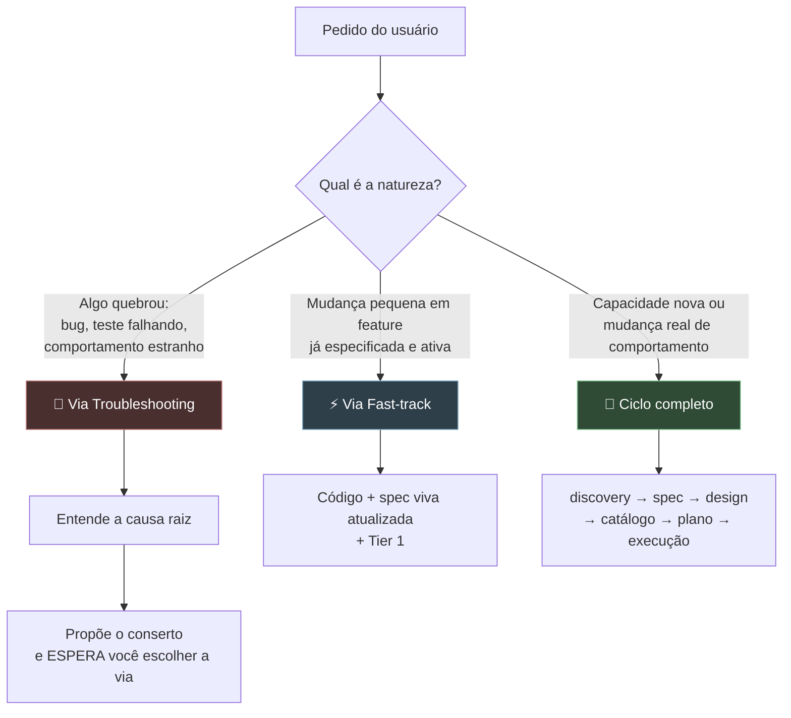
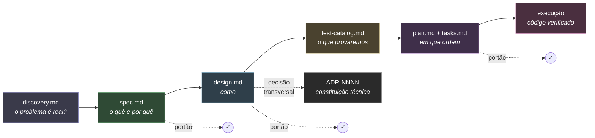
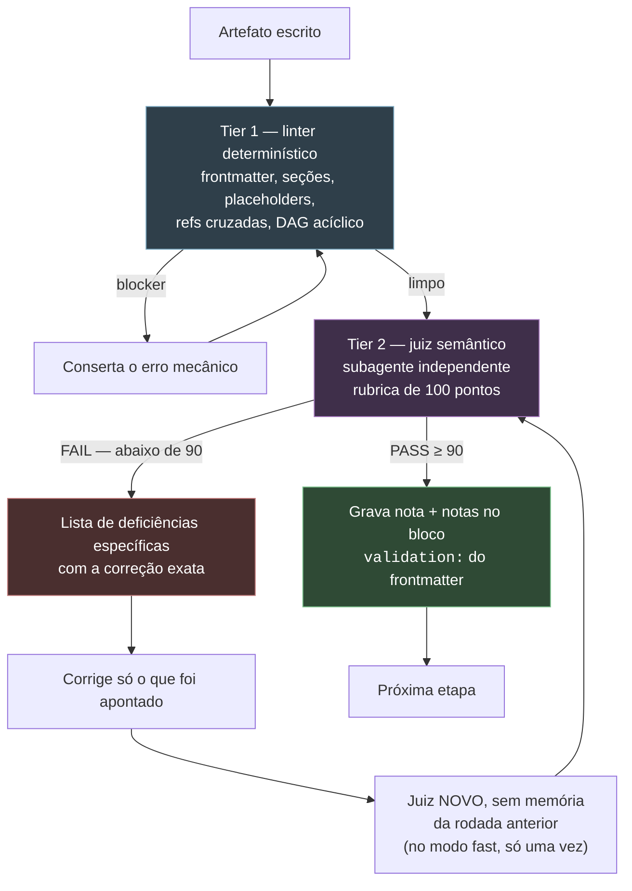
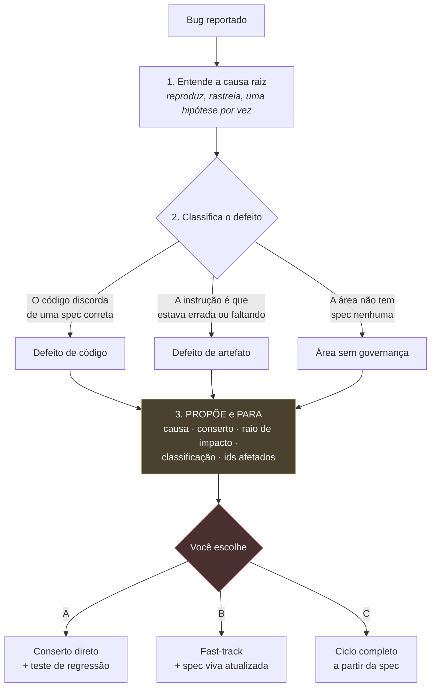

# sdd — Spec-Driven Development para Claude Code

> **O código não nasce de uma conversa. Nasce de uma especificação aprovada.**

`sdd` é um plugin do Claude Code que troca o "planejamento por conversa" por
um **pipeline de artefatos com portões de qualidade**. Cada etapa produz um
documento; cada documento passa por um linter determinístico e por um juiz
semântico independente antes que a próxima etapa comece.

A regra que sustenta tudo é **inferência zero**: se um requisito, contrato,
comportamento, modelo ou limiar não foi dito, o agente **para e pergunta**.
Ele nunca preenche a lacuna com um palpite plausível.

---

## Por que isso existe

Todo mundo já viveu isto:

| O que acontece sem SDD | O que o `sdd` faz |
|---|---|
| "Entendi, vou implementar" — e o agente inventa metade das regras | Cada lacuna vira uma pergunta direta. `Vou assumir que...` é proibido |
| O agente concorda com a primeira solução que você propõe | Passe de desafio obrigatório **antes** de qualquer concordância |
| A spec tem `TODO`, `TBD`, `etc.` e ninguém percebe | São blockers duros no linter, não rascunhos |
| Você recebe 300 linhas de documento e valida por cansaço | Resumo de **15 linhas em português claro** antes do documento real |
| "Os testes passaram" — mas ninguém rodou nada | Verificação independente antes de marcar qualquer tarefa como feita |
| O agente decide o banco, o modelo, o limiar de cobertura | Trade-offs arquiteturais são **sempre** decisão do humano |
| Um bug vira um refactor de 12 arquivos sem aviso | O agente propõe, e **você** escolhe a via antes de uma linha ser escrita |

---

## Instalação

Dentro do Claude Code, adicione este repositório como marketplace:

```bash
/plugin marketplace add DiegoRFSantos/skill-sdd
```

E instale o plugin:

```bash
/plugin install sdd@sdd-marketplace
```

Pelo terminal, se você tiver o CLI do Claude Code:

```bash
claude plugin marketplace add DiegoRFSantos/skill-sdd
```

```bash
claude plugin install sdd@sdd-marketplace
```

Para fixar uma versão específica, use a tag: `DiegoRFSantos/skill-sdd@v1.1.0`.

Depois é só falar normalmente — a skill se ativa sozinha em pedidos de
feature, mudança, bug ou revisão de artefato.

---

## As três vias

O primeiro trabalho da skill não é escrever spec. É **classificar o pedido**.
Mandar um typo pelo ciclo completo é tão errado quanto mandar uma feature
nova direto pro código.



**Na dúvida, sobe para a via mais lenta.** Classificar devagar demais custa
uma passada de plano; classificar rápido demais entrega uma regra de negócio
que ninguém revisou.

---

## O ciclo completo



| Etapa | Pergunta que responde |
|---|---|
| **discovery** | O problema está bem entendido? Que alternativas e riscos foram considerados antes de escolher um caminho? |
| **spec** | O que vamos construir e por quê — regras de negócio, critérios de aceite em Gherkin, não-objetivos, casos de borda |
| **design (+ADRs)** | Como será construído — contratos, schemas, fluxos, resiliência, observabilidade |
| **test-catalog** | Quais cenários concretos, acordados com um humano, provam que a spec foi cumprida |
| **plan/tasks** | Quais marcos, qual o grafo de dependências, qual agente faz o quê |
| **execução** | O código, escrito contra tarefas aprovadas, marcado como feito só depois que os testes rodam de verdade |

---

## O resumo de 15 linhas

O maior problema de um documento de 300 linhas é que o humano valida a
**forma** antes de ter entendido o **conteúdo** — e quem ainda está
descobrindo do que o documento trata passa batido justamente pela parte que
precisava do julgamento dele.

Antes de escrever qualquer artefato, a skill oferece um resumo curto:

```
─────────────────────────────────────────────────────────
Do que se trata
  Hoje o pedido é cancelado quando um dos pagantes não
  cobre a parte dele. Queremos que o grupo feche mesmo assim.

O que vai fazer
  • O organizador divide o valor entre até 5 pessoas, por %
  • Cada pessoa paga a própria parte, no próprio meio
  • Se alguém não pagar em 15 min, o pedido inteiro cai
  • O organizador vê quem pagou e quem não pagou, em tempo real

O que NÃO vai fazer
  • Ninguém além do organizador pode mudar a divisão
  • Divisão por item (só por porcentagem, nesta versão)

Em aberto
  Nada.
─────────────────────────────────────────────────────────
```

Três regras que fazem isso funcionar:

1. **Nunca automático.** A skill pergunta antes, ou lê sua preferência.
2. **Nunca passa pelo portão.** O resumo não é lintado e não vai para o juiz
   — **você é o único validador dele**.
3. **Nunca vira arquivo.** É uma checagem de conversa, não um artefato.

Para não responder a mesma pergunta toda vez:

```yaml
# .specs/sdd.config.yml
summary_preview: ask   # always | never | ask
judge_model: sonnet    # em qual modelo o juiz do Tier 2 roda
judge_depth: fast      # fast | full
dashboard: on          # painel de progresso local — on | off
```

Com `dashboard: on`, a skill sobe um painel local que mostra em que ponto a
feature está — quais artefatos existem e que nota tiraram, o marco atual, o
estado de cada tarefa e o log de bloqueios:

```bash
python3 ${CLAUDE_PLUGIN_ROOT}/skills/sdd/scripts/sdd_status.py --serve --repo-root .
# http://127.0.0.1:4517
```

Ele não custa token nenhum: tudo que aparece ali **já está em disco**, porque a
skill guarda o estado em arquivo e não na sessão. O painel lê os mesmos
arquivos que o agente escreve. A economia vem de outro lugar — o agente para de
narrar progresso no chat, e você olha em vez de ler.

As mesmas 15 linhas do resumo viram a seção `## 0. At a Glance` do artefato —
escritas uma vez, usadas nos dois lugares. Em `spec.md` e `design.md` essa
seção é obrigatória e o limite de 15 linhas é verificado pelo linter. Ela
nunca é julgada pelo Tier 2: uma rubrica feita para um contrato de 200 linhas
avalia um resumo de 15 como catastroficamente incompleto, o que é verdade e é
inútil.

---

## O portão de qualidade, em dois níveis



**O juiz é sempre um estranho.** Quem escreveu o artefato não pode
corrigi-lo: já sabe o que *quis dizer*, e lê a própria frase vaga como
suficiente. O Tier 2 roda obrigatoriamente como subagente separado, que
recebe apenas o texto do artefato e a rubrica — nunca a conversa que o
gerou.

**Um juiz por rodada, nunca em paralelo.** O pipeline é sequencial por
construção — design depende de spec ativa —, então disparar vários juízes ao
mesmo tempo não ganha nada e faz o mais lento ditar o relógio de todos.

**Dois modos, mesma rubrica.** `fast` e `full` usam os mesmos critérios, os
mesmos pesos e a mesma nota de corte de 90. A diferença é quanto o juiz
escreve e quantas vezes ele roda:

| | `fast` | `full` |
|---|---|---|
| Critério com nota cheia | só a nota | nota + justificativa |
| Critério abaixo do máximo | nota + deficiência + correção | idem, com justificativa |
| Limite de rodadas | **1 rejulgamento**, depois você decide | sem limite |

O modo `fast` só é viável porque cada exigência da rubrica também está escrita
como regra de autoria nas referências `artifact-*.md`: o artefato nasce
aprovado em vez de ser corrigido até passar.

**A nota fica no arquivo, não no chat:**

```yaml
validation:
  - tier1: pass
  - tier1_at: 2026-08-27
  - tier2_score: 94
  - tier2_verdict: PASS
  - tier2_at: 2026-08-27
  - tier2_rounds: 1
  - judge_model: sonnet
  - judge_depth: fast
  - notes: "Rodada 1 tirou 82 - o EC-04 era o caminho feliz disfarçado.
            Reescrito como limite de submissão concorrente."
```

Isso não é burocracia: na hora de implementar, a skill **lê esse bloco em
vez de rodar o portão de novo**. Você não paga duas vezes pela mesma
validação.

---

## Quando algo quebra

A via de troubleshooting é rápida de propósito — e tem uma lei só:

> **Nenhum conserto é escrito antes de você ver qual é o conserto e escolher
> a via.**



Mesmo quando você diz "só conserta" — isso escolhe a via A, e **não** é
permissão para pular o teste de regressão nem para reescrever uma regra de
negócio de passagem.

---

## Exemplos de uso

### 1. Feature nova, do zero

```
Você: quero deixar o pessoal dividir a conta de um pedido em grupo
```

O que acontece:

1. **Desafio antes de concordar.** "Antes de aceitar: o problema é o
   pagamento dividido, ou é o pedido ser cancelado quando alguém não paga?"
2. **discovery.md** — problema, alternativas descartadas, riscos aceitos,
   ledger de perguntas em aberto (que precisa fechar antes de seguir).
3. **Resumo de 15 linhas** → você aprova ou corrige. Ele vira o
   `## 0. At a Glance` do artefato.
4. **spec.md** — `BR-01..NN` e `AC-01..NN` em linhas de tabela, casos de
   borda, matriz de rastreabilidade. Nenhum nome de tecnologia, nenhuma rota
   HTTP.
5. **Portão** → Tier 1 limpo, Tier 2 tirou 94/100, nota gravada no arquivo.
6. **design.md** → contratos com o símbolo e a assinatura exatos, fluxos com
   falha parcial, timeouts com número (nunca "um valor razoável"), e o
   **§9 File Map**: todo arquivo que a feature toca, pelo caminho literal.
7. **test-catalog.md** → você assina os cenários que importam.
8. **plan.md + tasks.md** → marcos entregáveis, DAG no nível de marco, e cada
   tarefa com a tag `[files: ...]` dizendo exatamente onde ela pode escrever.
9. **Handoff** → com o `tasks.md` aprovado, a skill te dá o comando pra abrir
   uma sessão nova, em vez de implementar com a janela de contexto cheia da
   entrevista.
10. **Execução** → um worktree por stream, um subagente novo por tarefa,
    testes rodados de verdade antes de qualquer `[x]`.

### 2. Mudança pequena numa feature já pronta

```
Você: aumenta a janela de configuração da divisão de 15 pra 20 minutos
```

A skill checa os três critérios de elegibilidade **contra o arquivo**, não
de memória: 1 arquivo, ~6 linhas, mexe no limiar de um `EC` que já existe,
nenhuma tabela/tópico/integração nova. Elegível.

Resultado: código alterado, `EC-03` atualizado na spec viva, `updated_at`
novo, linha no changelog explicando **por que** foi fast-track, Tier 1
rodado, commit com tag `[fast-track]`.

### 3. Bug

```
Você: tá deixando a soma das porcentagens passar de 100%
```

```
Causa raiz    validateAllocation() usa <= quando a BR-02 diz < ;
              soma de 100.5% passa
Conserto      1 arquivo, 1 linha, + 1 teste de regressão
Raio          só o caminho de submissão; nada mais chama essa função
Classificação Defeito de código — a spec está certa, o código discorda
Ids afetados  BR-02, AC-03

Recomendo a via A (conserto direto). Mas a BR-02 é uma regra de
dinheiro, então me diga: A, B (fast-track com nota na spec) ou C?
```

E aí ele **espera**.

### 4. Sessão fria, retomando no meio

```
Você: continua de onde paramos
```

O estado mora no disco, não na memória da conversa. A skill relê
`.specs/features/*/` e responde algo como: *"payment-split: spec e design
ativos, catálogo assinado, plano no marco M2, 9/16 tarefas feitas, Task 2.4
marcada `[/]` — vou checar se ela realmente começou antes de continuar."*

---

## Mapa dos artefatos

Tudo de uma feature mora numa pasta só:

```
.specs/
  sdd.config.yml                    # opcional: resumo curto, modelo e modo do juiz
  features/
    payment-split/
      discovery.md                  # fase 0: problema, desafio, ledger
      spec.md                       # o quê e por quê — linguagem de negócio
      design.md                     # como — contratos, fluxos, resiliência
      test-catalog.md               # cenários assinados por um humano
      plan.md                       # marcos, DAG, papéis    ← efêmero
      tasks.md                      # checklist ao vivo      ← efêmero
.adrs/
  0002-client-supplied-idempotency-key-standard.md
```

**`plan.md` e `tasks.md` são efêmeros.** Eles descrevem como *uma* entrega
foi sequenciada, não o que o sistema é. Quando o último marco fecha, a skill
marca os dois como concluídos, resgata do log de bloqueios qualquer coisa
que precise sobreviver, e **pergunta a você**: apagar (o git guarda) ou
arquivar. Nunca faz sozinha, e nunca com tarefa `[REQUIRED]` em aberto.

Pastas são criadas **só quando existe arquivo para colocar dentro**. Pasta
vazia é uma mentira: diz que uma fase começou e foi abandonada, quando na
verdade ela nunca foi alcançada.

---

## O linter, por fora da skill

O Tier 1 é determinístico e dirigido por regras
(`skills/sdd/scripts/rules.json`). Os dois runners aceitam o mesmo contrato
de CLI — um ou mais caminhos de artefato, mais:

- `--repo-root <path>` — raiz usada para resolver `refs` entre artefatos.
  Padrão: `.`
- `--json` — emite os achados como array JSON em vez do relatório legível.

```bash
python3 skills/sdd/scripts/sdd_lint.py <artefato.md> --repo-root .
```

```bash
node skills/sdd/scripts/sdd_lint.mjs <artefato.md> --repo-root .
```

Saída `0` = nenhum blocker (ainda pode haver achados `review`). Saída `1` =
pelo menos um blocker.

Exemplo, contra uma fixture com `author` faltando de propósito:

```bash
python3 skills/sdd/scripts/sdd_lint.py tests/fixtures/spec_missing_author/spec.md --repo-root tests/fixtures/spec_missing_author
```

```
spec.md
  [blocker] FM_MISSING_KEY:1 frontmatter missing required key: author

1 blocker(s), 0 review item(s)
```

Duas regras emitem `review` sem reprovar o portão. `catalog_coverage_prompt`
aponta ids `AC-NN`/`EC-NN` da spec sem caso de teste no catálogo e sem registro
em "Deliberate Gaps". `LINE_BUDGET` avisa quando um artefato passa do orçamento
de linhas do seu tipo (spec 200, design 250, discovery 170, adr 120,
test-catalog 120, plan 150, tasks 120) — uma feature realmente grande pode
passar, ela só não passa sem ninguém perceber.

---

## Elegibilidade do fast-track

Só é elegível quando **os três** valem:

1. Mexe numa feature existente sem introduzir invariante ou entidade nova.
2. Toca no máximo 3 arquivos **e** menos de 50 linhas. (É **E**, não **ou** —
   2 arquivos com 80 linhas não passa.)
3. Não adiciona tabela, tópico de mensageria nem integração de terceiro.

O fast-track pula `plan.md` e `tasks.md`. Atualiza a spec viva direto,
roda o Tier 1, e comita com a tag `[fast-track]`. Se bater a vontade de
chamar o juiz do Tier 2 "só por segurança", isso é sinal de que a mudança
**nunca foi fast-track** — refaça a classificação.

---

## O que a skill nunca faz

- Escrever `plan.md` antes de `spec.md` e `design.md` estarem `active`
- Escolher modelo, limiar de cobertura ou estratégia de rollout no seu lugar
- Revalidar um artefato na hora de implementar quando o bloco `validation:`
  já registra um PASS e nada mudou
- Lintar ou julgar o resumo de 15 linhas, nem a seção `## 0. At a Glance`
- Disparar mais de um juiz por artefato por rodada, ou julgar dois artefatos
  ao mesmo tempo
- Escolher o modelo do juiz ou o modo `fast`/`full` sem perguntar
- Escrever uma tarefa sem a tag `[files: ...]`, ou citar arquivo e símbolo por
  descrição quando o design os nomeia literalmente
- Publicar um diagrama mermaid acima do limite de nós — o certo é não publicar
- Criar pasta antes de existir arquivo para pôr dentro
- Marcar tarefa como `[x]` sem rodar o teste dela
- Passar de um marco sem você assinar embaixo
- Escrever um conserto antes de você ver a proposta e escolher a via
- Editar um ADR já `accepted` — o certo é superseder

---

## Estado do projeto

Completo e exercitado ponta a ponta: o esqueleto do plugin, o roteador
(`skills/sdd/SKILL.md`), as regras para os sete tipos de artefato, os dois
runners do linter, e 18 fixtures passando nos dois runners via
`tests/run_fixtures.py`.

Também prontos: os sete templates e suas referências de autoria, um exemplo
completo em `tests/golden/payment-split/` que linta limpo de ponta a ponta,
as quatro rubricas de 100 pontos do Tier 2 com o contrato de despacho do
juiz independente e o loop de triagem, o motor de execução, a via de
fast-track, a via de troubleshooting e o resumo curto de 15 linhas.

O ciclo completo já foi rodado ponta a ponta em repositórios de teste fora
deste plugin: uma passada de discovery até execução com worktrees, um teste
de retomada de sessão fria no meio de um plano (que revelou e levou ao
conserto de uma falha real do linter), e um teste de classificação de
fast-track.

## Licença

MIT — veja [LICENSE](LICENSE).
