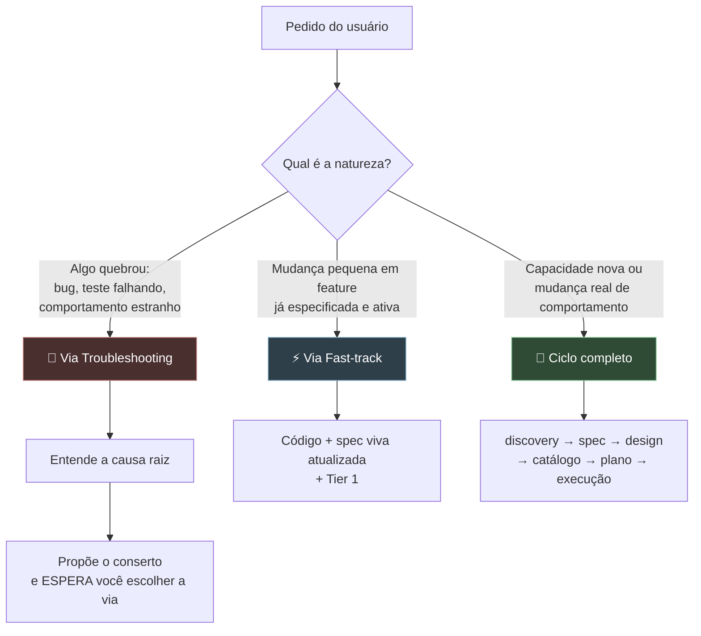
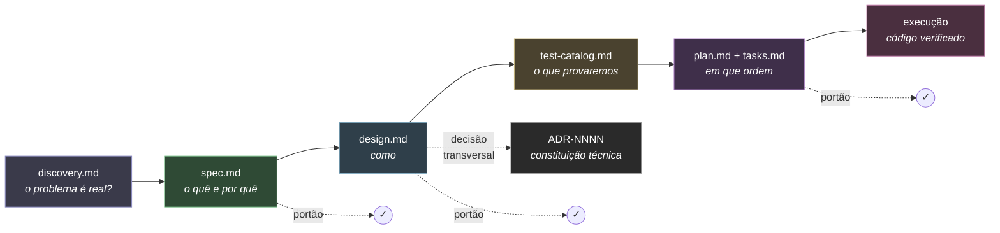
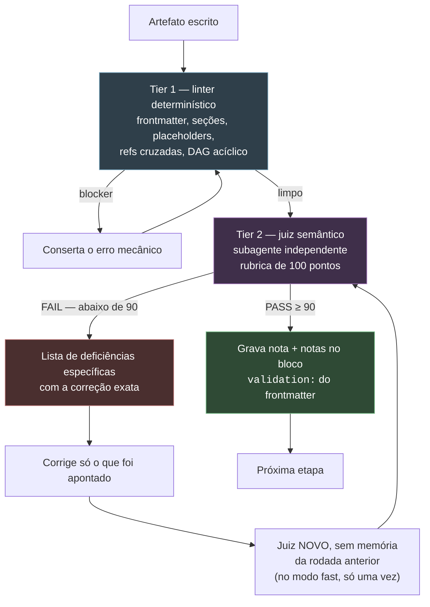
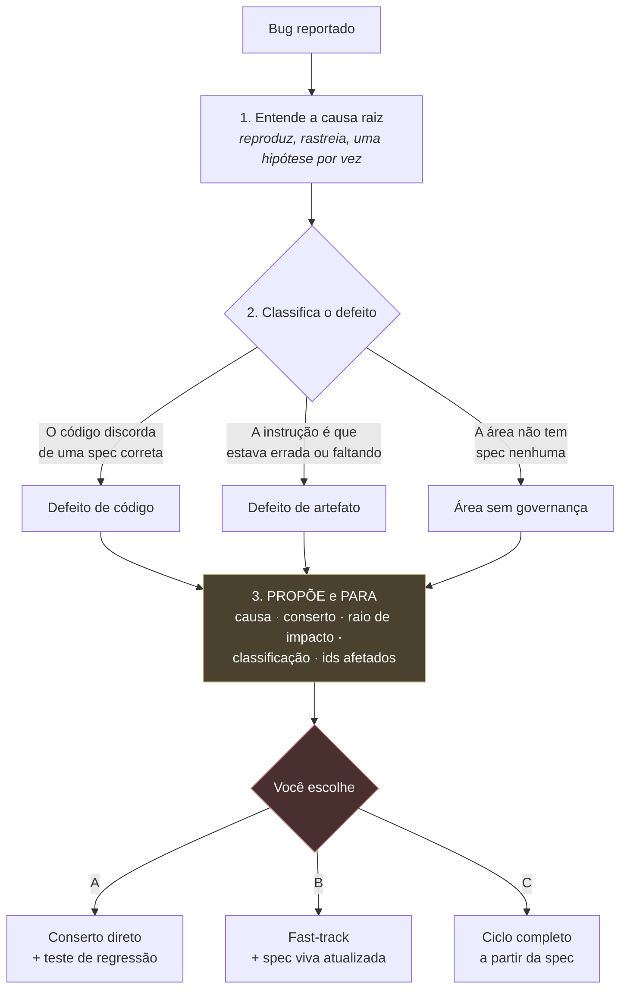

# sdd — Spec-Driven Development para agentes de código

> **O código não nasce de uma conversa. Nasce de uma especificação aprovada.**

`sdd` é uma skill que troca o "planejamento por conversa" por um **pipeline de
artefatos com portões de qualidade**.

Funciona em **qualquer agente de código** que saiba ler arquivos, rodar comandos
no shell e despachar um subagente — Claude Code, Cursor, Copilot CLI, Gemini
CLI, Codex e afins. Não há dependência de nenhum deles: o estado mora em
arquivos markdown no seu repositório, e as ferramentas são scripts Python/Node
comuns. O que muda de um agente pro outro é só o nome do comando de limpar
contexto e o formato do despacho de subagente — a skill pergunta ou detecta. Cada etapa produz um
documento; cada documento passa por um linter determinístico e por um juiz
semântico independente antes que a próxima etapa comece.

A regra que sustenta tudo é **inferência zero**: se um requisito, contrato,
comportamento, modelo ou limiar não foi dito, o agente **para e pergunta**.
Ele nunca preenche a lacuna com um palpite plausível.

---

## Como é usar

Cinco cenários reais, do começo ao fim. Se você só tem um minuto, leia o
primeiro — ele mostra o ciclo inteiro.

### 1. Feature nova, do zero

```
Você: quero deixar o pessoal dividir a conta de um pedido em grupo
```

O que acontece:

1. **Desafio antes de concordar.** *"Antes de aceitar: o problema é o pagamento
   dividido, ou é o pedido ser cancelado quando alguém não paga?"*
2. **discovery.md** — problema, alternativas descartadas, riscos aceitos,
   ledger de perguntas em aberto (que precisa fechar antes de seguir).
3. **Resumo de 15 linhas** → você aprova ou corrige. Ele vira o
   `## 0. At a Glance` do artefato.
4. **spec.md** — `BR-01..NN` e `AC-01..NN` em linhas de tabela, casos de borda,
   matriz de rastreabilidade. Nenhum nome de tecnologia, nenhuma rota HTTP.
5. **Portão** → uma linha: `spec.md — Tier 1 pass, Tier 2 94 PASS (1 rodada)`.
   Junto vem a oferta de `/clear`, com quanto ela economiza.
6. **design.md** → contratos com o símbolo e a assinatura exatos, fluxos com
   falha parcial, timeouts com número (nunca "um valor razoável"), um diagrama
   de sequência com as ramificações de erro, e o **§9 File Map**: todo arquivo
   que a feature toca, pelo caminho literal.
7. **test-catalog.md** → você assina os cenários que importam.
8. **plan.md + tasks.md** → marcos entregáveis, DAG no nível de marco, e cada
   tarefa com a tag `[files: ...]` dizendo exatamente onde ela pode escrever.
   Antes disso, a skill pergunta qual modelo pra cada papel — **com uma
   recomendação e uma justificativa por papel**, nunca em branco.
9. **Handoff** → com o `tasks.md` aprovado, a skill te dá o comando pra abrir
   uma sessão nova, em vez de implementar com a janela de contexto cheia da
   entrevista.
10. **Execução** → um worktree por stream, um subagente novo por tarefa, cada
    um recebendo só os caminhos e símbolos da tarefa dele, e testes rodados de
    verdade antes de qualquer `[x]`.

### 2. Mudança pequena numa feature já pronta

```
Você: aumenta a janela de configuração da divisão de 15 pra 20 minutos
```

A skill checa os três critérios de elegibilidade **contra o arquivo**, não de
memória: 1 arquivo, ~6 linhas, mexe no limiar de um `EC` que já existe, nenhuma
tabela/tópico/integração nova. Elegível.

Resultado: código alterado, `EC-03` atualizado na spec viva, `## 0. At a Glance`
relido (e corrigido, se as 15 linhas ficaram mentirosas), `updated_at` novo,
linha no changelog explicando **por que** foi fast-track, Tier 1 rodado, commit
com tag `[fast-track]`.

### 3. Bug

```
Você: tá deixando a soma das porcentagens passar de 100%
```

```
Causa raiz    validateAllocation() usa <= quando a BR-02 diz < ;
              soma de 100.5% passa
Conserto      1 arquivo, 1 linha, + 1 teste de regressão
Raio          só o caminho de submissão; nada mais chama essa função
Classificação Defeito de código — a spec está certa, o código discorda
Ids afetados  BR-02, AC-03

Recomendo a via A (conserto direto). Mas a BR-02 é uma regra de
dinheiro, então me diga: A, B (fast-track com nota na spec) ou C?
```

E aí ele **espera**. As três vias — conserto direto, fast-track e ciclo
completo — estão detalhadas em [Quando algo quebra](#quando-algo-quebra).

### 4. Sessão fria, retomando no meio

```
Você: continua de onde paramos
```

O estado mora no disco, não na memória da conversa. A skill relê
`.specs/features/*/` com `grep` — sem abrir os artefatos — e responde em uma
linha: *"payment-split: spec e design ativos, catálogo assinado, plano no marco
M2, 9/16 tarefas feitas, Task 2.4 marcada `[/]` — vou checar se ela realmente
começou antes de continuar."*

### 5. Implementando um plano aprovado

```
Você: Execute the SDD plan at .specs/features/payment-split/tasks.md
```

Esse é o comando que a skill te entrega no handoff. Numa sessão nova, ela lê o
`tasks.md`, confere os blocos `validation:` **sem re-rodar portão nenhum**, e
começa a despachar tarefas — cada uma para um subagente novo, com os caminhos
do `[files: ...]` e a fatia exata do design que aquela tarefa implementa.

---

## Por que isso existe

Todo mundo já viveu isto:

| O que acontece sem SDD | O que o `sdd` faz |
|---|---|
| "Entendi, vou implementar" — e o agente inventa metade das regras | Cada lacuna vira uma pergunta direta. `Vou assumir que...` é proibido |
| O agente concorda com a primeira solução que você propõe | Passe de desafio obrigatório **antes** de qualquer concordância |
| A spec tem `TODO`, `TBD`, `etc.` e ninguém percebe | São blockers duros no linter, não rascunhos |
| Você recebe 300 linhas de documento e valida por cansaço | Resumo de **15 linhas em linguagem clara**, que vira a primeira seção do artefato |
| "Os testes passaram" — mas ninguém rodou nada | Verificação independente antes de marcar qualquer tarefa como feita |
| O agente decide o banco, o modelo, o limiar de cobertura | Trade-offs arquiteturais são **sempre** decisão do humano |
| Um bug vira um refactor de 12 arquivos sem aviso | O agente propõe, e **você** escolhe a via antes de uma linha ser escrita |
| A sessão vira uma bola de neve de contexto e a conta explode | A skill mede, avisa quanto um `/clear` economiza, e passa o bastão pra uma sessão nova |

---

## Instalação

### Qualquer agente (manual — funciona em todos)

Copie a pasta `skills/sdd` para onde o seu agente procura skills. Passo a passo
mais abaixo, em **Instalação manual**. Se o seu agente não tiver um lugar
padrão, exporte `SDD_HOME` apontando pra pasta e pronto:

```bash
export SDD_HOME=/caminho/para/skills/sdd
```

### Claude Code (marketplace)

Dentro do Claude Code, adicione este repositório como marketplace:

```bash
/plugin marketplace add DiegoRFSantos/skill-sdd
```

E instale o plugin:

```bash
/plugin install sdd@sdd-marketplace
```

Pelo terminal, se você tiver o CLI do Claude Code:

```bash
claude plugin marketplace add DiegoRFSantos/skill-sdd
```

```bash
claude plugin install sdd@sdd-marketplace
```

Para fixar uma versão, acrescente uma tag existente do repositório ao slug —
por exemplo `DiegoRFSantos/skill-sdd@v2.0.0`. Sem tag, você acompanha o branch
padrão.

Depois é só falar normalmente — a skill se ativa sozinha em pedidos de
feature, mudança, bug ou revisão de artefato.

### Instalação manual (qualquer agente)

Funciona em qualquer ferramenta, inclusive as que não têm marketplace. São dois
passos.

**1. Baixe os arquivos.** Clique em **Code → Download ZIP** na página do
repositório no GitHub e descompacte. Ou, se você usa git:

```bash
git clone https://github.com/DiegoRFSantos/skill-sdd.git
```

**2. Copie a pasta `skills/sdd` para um destes dois lugares:**

| Onde colar | Caminho | Quando usar |
|---|---|---|
| **Só neste projeto** | `<seu-projeto>/.claude/skills/sdd` | Quer testar, ou usar só num repositório |
| **Em todos os projetos** | `~/.claude/skills/sdd` | Quer a skill sempre disponível |
| **Outro agente** | onde ele procurar, ou qualquer pasta + `export SDD_HOME=<pasta>` | Não usa Claude Code |

No terminal, a partir da pasta que você baixou:

```bash
mkdir -p ~/.claude/skills
cp -r skills/sdd ~/.claude/skills/sdd
```

Ou, para um projeto só:

```bash
mkdir -p /caminho/do/seu-projeto/.claude/skills
cp -r skills/sdd /caminho/do/seu-projeto/.claude/skills/sdd
```

No Finder ou no Explorador de Arquivos funciona igual: arraste a pasta `sdd`
(a que está dentro de `skills/`) para dentro de `.claude/skills/`.

**Pronto.** No final você precisa ter este arquivo existindo:

```
~/.claude/skills/sdd/SKILL.md          (ou .claude/skills/sdd/SKILL.md no projeto)
```

Abra o agente de novo e peça alguma coisa — "quero criar uma feature de X". A
skill se ativa sozinha. Em agentes que não carregam skills automaticamente,
aponte pro `SKILL.md` e peça pra seguir o que está lá.

> **A pasta `.claude` começa com ponto e fica escondida.** No Finder, aperte
> `Cmd + Shift + .` para ver arquivos ocultos. Se ela não existir, pode criar.

Você **não** precisa copiar o resto do repositório — `tests/`, `docs/` e
`.claude-plugin/` só interessam a quem for mexer na própria skill.

---

## Requisitos

- **`python3` ou `node`** para o linter. Qualquer um dos dois serve: os dois
  runners produzem exatamente os mesmos achados, e a suíte de testes falha se
  eles discordarem. Quase todo Mac e Linux já vem com pelo menos um.
- **`git`** é opcional. Sem ele a execução cai para modo sequencial, sem
  worktrees — e a skill avisa em voz alta que está degradada, em vez de fingir
  que está tudo normal.
- **Um agente** que leia arquivos, rode comandos e despache subagentes. Sem
  despacho de subagente o Tier 2 não roda; o Tier 1 e todo o resto continuam
  funcionando, e a skill avisa.

Nada mais. Nenhuma dependência para instalar, nenhuma chave de API, nenhum
serviço externo.

---

## As três vias

O primeiro trabalho da skill não é escrever spec. É **classificar o pedido**.
Mandar um typo pelo ciclo completo é tão errado quanto mandar uma feature
nova direto pro código.



**Na dúvida, sobe para a via mais lenta.** Classificar devagar demais custa
uma passada de plano; classificar rápido demais entrega uma regra de negócio
que ninguém revisou.

---

## O ciclo completo



| Etapa | Pergunta que responde |
|---|---|
| **discovery** | O problema está bem entendido? Que alternativas e riscos foram considerados antes de escolher um caminho? |
| **spec** | O que vamos construir e por quê — regras de negócio, critérios de aceite, não-objetivos, casos de borda |
| **design (+ADRs)** | Como será construído — contratos com símbolo e assinatura, fluxos, resiliência, observabilidade, e o mapa de arquivos |
| **test-catalog** | Quais cenários concretos, acordados com um humano, provam que a spec foi cumprida |
| **plan/tasks** | Quais marcos, qual o grafo de dependências, qual agente faz o quê, e em quais arquivos |
| **execução** | O código, escrito contra tarefas aprovadas, marcado como feito só depois que os testes rodam de verdade |

Artefatos são **curtos de propósito**. Cada tipo tem um orçamento de linhas, e
regras de negócio, critérios de aceite e casos de borda são **linhas de
tabela**, não blocos de três parágrafos. Passar do orçamento é permitido para
uma feature realmente grande — só não passa despercebido.

---

## O resumo de 15 linhas

O maior problema de um documento de 300 linhas é que o humano valida a
**forma** antes de ter entendido o **conteúdo** — e quem ainda está
descobrindo do que o documento trata passa batido justamente pela parte que
precisava do julgamento dele.

Antes de escrever qualquer artefato, a skill mostra um resumo curto:

```
─────────────────────────────────────────────────────────
Do que se trata
  Hoje o pedido é cancelado quando um dos pagantes não
  cobre a parte dele. Queremos que o grupo feche mesmo assim.

O que vai fazer
  • O organizador divide o valor entre até 5 pessoas, por %
  • Cada pessoa paga a própria parte, no próprio meio
  • Se alguém não pagar em 15 min, o pedido inteiro cai
  • O organizador vê quem pagou e quem não pagou, em tempo real

O que NÃO vai fazer
  • Ninguém além do organizador pode mudar a divisão
  • Divisão por item (só por porcentagem, nesta versão)

Em aberto
  Nada.
─────────────────────────────────────────────────────────
```

**Escrito uma vez, usado em dois lugares.** As mesmas 15 linhas viram a seção
`## 0. At a Glance` do artefato — obrigatória em `spec.md` e `design.md`, com
o limite verificado pelo linter. Quem abrir o arquivo daqui a seis meses lê 15
linhas antes de decidir se lê as outras 180.

Três regras que fazem isso funcionar:

1. **A prévia no chat nunca é automática.** A skill pergunta antes, ou lê sua
   preferência do arquivo de configuração.
2. **Nunca passa pelo portão.** Nem a prévia nem o `## 0. At a Glance` são
   julgados — **você é o único validador**. Uma rubrica feita para um contrato
   de 200 linhas avalia um resumo de 15 como catastroficamente incompleto, o
   que é verdade e é inútil.
3. **Vem depois da entrevista, nunca no lugar dela.** Um resumo que contrabandeia
   uma suposição não perguntada é o rascunho proibido, só que menor.

---

## O portão de qualidade, em dois níveis



**O juiz é sempre um estranho.** Quem escreveu o artefato não pode corrigi-lo:
já sabe o que *quis dizer*, e lê a própria frase vaga como suficiente. O Tier 2
roda obrigatoriamente como subagente separado, que recebe o **caminho** do
artefato e a rubrica — nunca a conversa que o gerou.

**Um juiz por rodada, nunca em paralelo.** O pipeline é sequencial por
construção — design depende de spec ativa —, então disparar vários juízes ao
mesmo tempo não ganha nada e faz o mais lento ditar o relógio de todos.

**Dois modos, mesma rubrica.** `fast` e `full` usam os mesmos critérios, os
mesmos pesos e a mesma nota de corte de 90. A diferença é quanto o juiz
escreve e quantas vezes ele roda:

| | `fast` | `full` |
|---|---|---|
| Critério com nota cheia | só a nota | nota + justificativa |
| Critério abaixo do máximo | nota + deficiência + correção | idem, com justificativa |
| Limite de rodadas | **1 rejulgamento**, depois você decide | sem limite |

O modo `fast` só é viável porque cada exigência da rubrica também está escrita
como **regra de autoria** nas referências `artifact-*.md`: o artefato nasce
aprovado em vez de ser corrigido até passar. Se artefatos começarem a reprovar
na primeira rodada com frequência, o que precisa de conserto são as regras de
autoria — não o limite.

**A nota fica no arquivo, não no chat:**

```yaml
validation:
  - tier1: pass
  - tier1_at: 2026-08-27
  - tier2_score: 94
  - tier2_verdict: PASS
  - tier2_at: 2026-08-27
  - tier2_rounds: 1
  - judge_model: sonnet
  - judge_depth: fast
  - notes: "Rodada 1 tirou 82 - o EC-04 era o caminho feliz disfarçado.
            Reescrito como limite de submissão concorrente."
```

Isso não é burocracia: na hora de implementar, a skill **lê esse bloco em vez
de rodar o portão de novo**. Um artefato sem bloco `validation:` faz a execução
parar e perguntar.

---

## Escolha de modelo por papel

A skill **nunca** chuta um modelo, e também **nunca** te entrega a pergunta em
branco. "Qual modelo pro papel de Coder?" faz você pesquisar — o oposto de
recomendar. O procedimento:

1. **Pergunta o que você alcança** (Claude por esta CLI, chave de API,
   Bedrock/Vertex/Foundry, outro provedor) — depois de checar `AGENTS.md` e
   `CLAUDE.md`, que podem já responder.
2. **Consulta o que existe hoje**, em vez de responder de memória. Preço, id e
   capacidade mudam mais rápido que qualquer arquivo desta skill, e um id
   desatualizado não degrada com elegância: ele quebra o despacho.
3. **Casa o papel com o risco dele**, que é a parte que não envelhece:

| Papel | Risco dominante | Aponta para |
|---|---|---|
| Coder | Interação sutil entre regras que o teste não pega | Tier alto na lógica de domínio; tier médio serve bem pra scaffolding, DTO, migration |
| Tester | Harness que passa sem exercitar a regra | Tier médio no volume; sobe quando o desenho do teste é a parte difícil |
| Reviewer | Falso negativo — o trabalho dele é justamente não deixar passar | Tier alto. Roda poucas vezes, então custo quase não se move |
| Evaluator (juiz) | Carimbar um artefato vago, ou inventar deficiência | Tier médio com effort alto. A rubrica dá a estrutura, e é o papel que mais roda — onde a escolha mexe mais na conta |

4. **Propõe um modelo por papel, com uma linha de justificativa cada**, e só
   escreve no `plan.md` depois que você confirmar.

O `effort` é um segundo botão: um modelo médio em `high`/`xhigh` costuma ganhar
de um modelo topo em `low`, por menos.

---

## FinOps — onde o token realmente vai

A regra que explica quase tudo:

> **custo ≈ turnos × tamanho do contexto**

Tudo que está no contexto é relido a cada turno seguinte. Ou seja: **ler um
arquivo não é um custo único.** Um artefato que entra no contexto cedo numa
sessão longa é relido em cada turno que vem depois — e é aí que a conta cresce,
não na leitura em si.

O que a skill faz com isso, em ordem de impacto:

1. **Nunca lê um arquivo que vai passar pra um subagente.** O contexto do
   subagente é descartável, o da sessão principal não. O juiz do Tier 2 recebe
   o path do artefato, não o texto colado.
2. **Extrai em vez de dar `cat`.** `sdd_extract.py design.md --section 3.1`
   devolve uma fatia no lugar do arquivo inteiro — e essa economia se repete a
   cada turno.
3. **Oferece limpar o contexto depois de cada artefato aprovado, com o número
   junto.** Não "considere limpar o contexto", e sim quanto isso economiza nos
   próximos turnos e quanto custa reconstruir — medido na hora, na sua sessão.
4. **Passa o bastão antes de implementar.** Com o `tasks.md` aprovado, a skill
   te dá o comando pra abrir uma sessão nova em vez de codar com a janela cheia
   da entrevista.
5. **Menos turnos.** Turnos são o outro multiplicador.

O que **não** funciona, e a skill diz isso na cara: comprimir artefato (o
agente precisa expandir pra ler, então o texto inteiro entra no contexto do
mesmo jeito) e encurtar o que você escreve (o que um humano digita é uma fração
irrelevante do total; um mal-entendido custa muito mais do que qualquer palavra
economizada).

Quer os números da **sua** sessão, não os de um exemplo? O painel mostra turnos,
contexto médio, cache read, entrada nova e saída por sessão — e
`sdd_status.py --context` diz quanto um reset economizaria agora.

As regras completas em `references/context-economy.md`.

---

## O painel de progresso

Opcional, local, e **custa zero token**.

```bash
python3 skills/sdd/scripts/sdd_status.py --serve --repo-root .
# http://127.0.0.1:4517
```

Mostra em que ponto cada feature está — quais artefatos existem e que nota
tiraram, o marco atual, o estado de cada tarefa com os arquivos que ela pode
tocar, o log de bloqueios, e o consumo de tokens por sessão.

Por que não custa nada: **tudo que aparece ali já está em disco**, porque a
skill guarda estado em arquivo e não na sessão. O painel lê os mesmos arquivos
que o agente escreve. Nenhuma chamada de API, nenhuma chave, nenhuma telemetria.

As métricas de token vêm das transcrições que o agente já grava localmente. O
Claude Code (`~/.claude/projects/`) é lido automaticamente; qualquer outro que
escreva um JSON por turno com um objeto `usage` entra apontando
`SDD_USAGE_DIR` pra pasta dele. Um agente que só exponha isso por API não é
lido aqui — e o painel diz isso, em vez de fingir.

| Recurso | Como funciona |
|---|---|
| **Vários projetos** | `--repo-root` é repetível; cada projeto vira uma aba com a contagem de tarefas abertas |
| **Renomear sessão** | Clique numa linha da tabela de consumo. O rótulo vai pra `~/.claude/sdd-dashboard-names.json`, nunca pro seu repositório |
| **Português e inglês** | Botão EN/PT-BR no cabeçalho, ou `--lang pt-BR`. Só a interface é traduzida — descrição de tarefa e nome de feature ficam no idioma em que você escreveu os artefatos |
| **Vários agentes** | Claude Code é lido sozinho; outros entram por `SDD_USAGE_DIR` |
| **Sinal de vida** | "última mudança há 12s — spec.md", lido do mtime dos arquivos |
| **Tarefas mais recentes primeiro** | O marco mais novo no topo; `tasks.md` mantém a ordem de dependência no disco |

Ligar por padrão:

```yaml
# .specs/sdd.config.yml
dashboard: on
```

A economia de token vem de outro lugar: com o painel aberto, o agente para de
narrar progresso no chat e você olha em vez de ler.

---

## Configuração

Tudo opcional. Sem arquivo, a skill pergunta — e `judge_model` e `judge_depth`
ela **nunca** chuta.

```yaml
# .specs/sdd.config.yml
summary_preview: ask     # always | never | ask  — mostrar o resumo no chat antes de escrever
judge_model: sonnet      # em qual modelo o juiz do Tier 2 roda
judge_depth: fast        # fast | full           — verbosidade e limite de rodadas
dashboard: off           # on | off              — painel de progresso local
```

---

## Quando algo quebra

A via de troubleshooting é rápida de propósito — e tem uma lei só:

> **Nenhum conserto é escrito antes de você ver qual é o conserto e escolher
> a via.**



Mesmo quando você diz "só conserta" — isso escolhe a via A, e **não** é
permissão para pular o teste de regressão nem para reescrever uma regra de
negócio de passagem.

---

## Mapa dos artefatos

Tudo de uma feature mora numa pasta só:

```
.specs/
  sdd.config.yml                    # opcional: resumo, modelo/modo do juiz, painel
  features/
    payment-split/
      discovery.md                  # fase 0: problema, desafio, ledger
      spec.md                       # o quê e por quê — linguagem de negócio
      design.md                     # como — contratos, fluxos, resiliência, file map
      test-catalog.md               # cenários assinados por um humano
      plan.md                       # marcos, DAG, papéis    ← efêmero
      tasks.md                      # checklist ao vivo      ← efêmero
.adrs/
  0002-client-supplied-idempotency-key-standard.md
```

**`plan.md` e `tasks.md` são efêmeros.** Eles descrevem como *uma* entrega foi
sequenciada, não o que o sistema é. Quando o último marco fecha, a skill marca
os dois como concluídos, resgata do log de bloqueios qualquer coisa que precise
sobreviver, e **pergunta a você**: apagar (o git guarda) ou arquivar. Nunca faz
sozinha, e nunca com tarefa `[REQUIRED]` em aberto.

Pastas são criadas **só quando existe arquivo para colocar dentro**. Pasta
vazia é uma mentira: diz que uma fase começou e foi abandonada, quando na
verdade ela nunca foi alcançada.

Um exemplo completo e lintado ponta a ponta vive em
`tests/golden/payment-split/`.

---

## Ferramentas de linha de comando

Os três scripts rodam fora da skill, direto no terminal. Os exemplos abaixo
usam o caminho de quem clonou o repositório; se você instalou pelo marketplace
ou copiou pra `.claude/skills/`, os scripts estão em `<pasta-da-skill>/scripts/`
— a própria skill descobre esse caminho sozinha antes de rodar qualquer coisa.

### Linter (Tier 1)

Determinístico e dirigido por regras (`skills/sdd/scripts/rules.json`). Os dois
runners aceitam o mesmo contrato de CLI e produzem achados idênticos:

```bash
python3 skills/sdd/scripts/sdd_lint.py <artefato.md> --repo-root .
```

```bash
node skills/sdd/scripts/sdd_lint.mjs <artefato.md> --repo-root .
```

- `--repo-root <path>` — raiz usada para resolver `refs` entre artefatos (padrão `.`)
- `--json` — emite os achados como array JSON em vez do relatório legível

Saída `0` = nenhum blocker (ainda pode haver achados `review`). Saída `1` = pelo
menos um blocker.

```bash
python3 skills/sdd/scripts/sdd_lint.py tests/fixtures/spec_missing_author/spec.md --repo-root tests/fixtures/spec_missing_author
```

```
spec.md
  [blocker] FM_MISSING_KEY:1 frontmatter missing required key: author

1 blocker(s), 0 review item(s)
```

Duas regras emitem `review` sem reprovar o portão. `catalog_coverage_prompt`
aponta ids `AC-NN`/`EC-NN` da spec sem caso de teste no catálogo e sem registro
em "Deliberate Gaps". `LINE_BUDGET` avisa quando um artefato passa do orçamento
do seu tipo (spec 200, design 250, discovery 170, adr 120, test-catalog 120,
plan 150, tasks 120).

### Extrator de seções

Devolve uma fatia do artefato em vez do arquivo inteiro — é o que mantém o
contexto pequeno quando uma tarefa precisa só do §3.1:

```bash
python3 skills/sdd/scripts/sdd_extract.py design.md --outline          # só os títulos
python3 skills/sdd/scripts/sdd_extract.py design.md --section 3.1      # uma seção
python3 skills/sdd/scripts/sdd_extract.py spec.md   --ids BR-01,AC-02  # linhas de tabela, com cabeçalho
python3 skills/sdd/scripts/sdd_extract.py spec.md   --glance           # o resumo de 15 linhas
```

Sai com código 1 quando nada casa — um resultado vazio e silencioso seria lido
pelo agente como "essa seção está vazia" em vez de "você pediu a coisa errada".

### Painel e custo

```bash
python3 skills/sdd/scripts/sdd_status.py --serve --repo-root .          # painel
python3 skills/sdd/scripts/sdd_status.py --json  --repo-root .          # estado em JSON
python3 skills/sdd/scripts/sdd_status.py --context --repo-root .        # quanto um /clear economiza
```

### Testes

```bash
python3 tests/run_fixtures.py
```

22 fixtures rodam nos dois runners e são comparadas achado a achado — se o
Python e o Node discordarem, a suíte falha. Ela também exige que os sete
templates e o exemplo completo lintem limpos, e cobre o extrator e o coletor
do painel.

---

## Elegibilidade do fast-track

Só é elegível quando **os três** valem:

1. Mexe numa feature existente sem introduzir invariante ou entidade nova.
2. Toca no máximo 3 arquivos **e** menos de 50 linhas. (É **E**, não **ou** —
   2 arquivos com 80 linhas não passa.)
3. Não adiciona tabela, tópico de mensageria nem integração de terceiro.

O fast-track pula `plan.md` e `tasks.md`. Atualiza a spec viva direto, roda o
Tier 1, e comita com a tag `[fast-track]`. Se bater a vontade de chamar o juiz
do Tier 2 "só por segurança", isso é sinal de que a mudança **nunca foi
fast-track** — refaça a classificação.

---

## O que a skill nunca faz

- Escrever `plan.md` antes de `spec.md` e `design.md` estarem `active`
- Escolher modelo, limiar de cobertura ou estratégia de rollout no seu lugar
- Perguntar qual modelo usar sem antes checar o que você alcança e propor um
  por papel, com justificativa
- Revalidar um artefato na hora de implementar quando o bloco `validation:` já
  registra um PASS e nada mudou
- Lintar ou julgar o resumo de 15 linhas, nem a seção `## 0. At a Glance`
- Disparar mais de um juiz por artefato por rodada, ou julgar dois artefatos ao
  mesmo tempo
- Escolher o modelo do juiz ou o modo `fast`/`full` sem perguntar
- Ler um artefato inteiro pro próprio contexto só pra colar num subagente
- Escrever uma tarefa sem a tag `[files: ...]`, ou citar arquivo e símbolo por
  descrição quando o design os nomeia literalmente
- Publicar um diagrama mermaid acima do limite de nós — o certo é não publicar
- Criar pasta antes de existir arquivo para pôr dentro
- Marcar tarefa como `[x]` sem rodar o teste dela
- Passar de um marco sem você assinar embaixo
- Escrever um conserto antes de você ver a proposta e escolher a via
- Editar um ADR já `accepted` — o certo é superseder

---

## Licença

MIT — veja [LICENSE](LICENSE).
