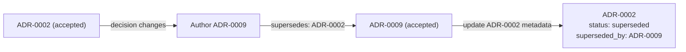

# Writing an ADR

## The four principles

**Explicit Trade-Offs (Consequences).** An ADR that lists only the upside of
its decision is marketing copy, not a record. §6 must name both the
Positive Consequences the decision buys and the Negative
Consequences/Risks it introduces or accepts — the storage cost, the
migration burden, the failure mode pushed onto callers. If a decision has no
downside worth writing down, that itself is worth double-checking before
acceptance.

**Considered Alternatives.** §4 exists so a future reader never has to
wonder "did anyone think of X." Every ADR documents at least two real,
named options, including the one rejected, and §5 gives the concrete
technical reason each alternative lost — not "we didn't like it," but the
specific failure mode or constraint that ruled it out. An ADR with only one
option isn't a decision record, it's an announcement.

**Traceability to Features.** A feature's `design.md` must list the ADR ids
it complies with in its frontmatter `dependencies` (e.g. `dependencies:
[ADR-0002]`), and its own ADR Conformance section maps each ADR's rule to
how the design satisfies it. This is what lets a reviewer — human or agent —
walk from a platform-wide decision down to every feature that has to obey
it, and back.

**Zero Ambiguity for Agents.** §5's Architectural Rules & Invariants and
§7's Compliance Verification must be concrete enough that a coding or
reviewing agent can check compliance mechanically, with no judgment call
left in between. "Use reasonable retry limits" is not a rule; "retry up to
5 times with exponential backoff starting at 500ms, capped at 8000ms" is. If
an agent would have to guess what counts as compliant, the ADR isn't done.

## The scope boundary against design.md

An ADR defines enterprise/system-wide technical standards — the choice of
message broker, database paradigm, authentication protocol, or a
concurrency/idempotency strategy applied across every service. It never
contains a feature-specific entity schema, endpoint contract, or DTO shape —
those belong in that feature's `design.md`. A design *complies with* ADRs
(§7 ADR Conformance records how); it never re-litigates them, and an ADR
never smuggles in one feature's schema.

The practical test, mirrored from the design/spec boundary: would this
decision matter to a feature that hasn't been imagined yet? If yes — a
storage engine choice, a broker choice, an idempotency-key standard applied
platform-wide — it's an ADR. If the decision only makes sense in the
context of one capability's data and contracts, it's a design.

## The immutability rule

Once an ADR's `status` is `accepted`, it is never edited again — not to fix
a typo in the decision, not to "clarify" the rule, not to adjust a number.
An accepted ADR is a historical record of what was decided and why, at the
time it was decided. If the decision itself changes, the answer is never
editing the existing file: it is authoring a brand-new ADR that explicitly
supersedes it.

## The supersede workflow

1. Never edit or delete the accepted ADR. Its content stays exactly as
   accepted, permanently.
2. Create the new ADR with `supersedes: ADR-<old>` in its frontmatter,
   pointing back at the decision it replaces.
3. Update the old ADR's own metadata only: set `status: superseded` and
   `superseded_by: ADR-<new>` — the body and original decision stay
   untouched; only these two frontmatter fields change.

## Quality checklist

Catch these before an ADR moves to `accepted`:

- Does it contain feature-specific database tables, endpoints, or localized
  DTO schemas? That content belongs in `design.md`, not here — move it out.
- Does it omit negative consequences, liabilities, or trade-offs? §6 needs
  both a Positive and a Negative subsection, not just the upside.
- Does it fail to list rejected alternatives and the concrete reasons they
  lost? §4 and §5 need at least two named, real options and a technical
  reason for the loser(s), not just the winner.
- Does it contain mutable instructions meant to be edited sprint over
  sprint? An ADR is a point-in-time record, not a living runbook — anything
  that needs periodic editing doesn't belong in an accepted ADR.

## Written to pass

- **The problem is genuinely cross-cutting.** It would matter to a feature
  nobody has imagined yet. One feature's schema or endpoint choice is a design
  decision, not an ADR.
- **Every considered option states the honest case for it** — the argument a
  competent engineer would actually make. An option written so it obviously
  loses is a straw man and scores zero, however many options sit in the table.
  If you cannot make the case for an alternative, you have not understood it
  well enough to reject it.
- **The outcome follows from the drivers.** A reader should be able to trace
  the choice back to the listed drivers without taking anything on faith.
- **The negative consequences are real costs**, not softened upsides. An
  all-positive consequences section scores zero on that criterion.
- **Compliance verification is concretely checkable** — a lint rule, a code
  pattern, a CI contract test. "Reviewers will watch for it" is not a check.

Optional single diagram: a `gitGraph` for a branching or release strategy, or
a `C4Context`/`architecture-beta` for a structural decision. Caps and the
beta-syntax caveat are the same as in `references/artifact-design.md`.
