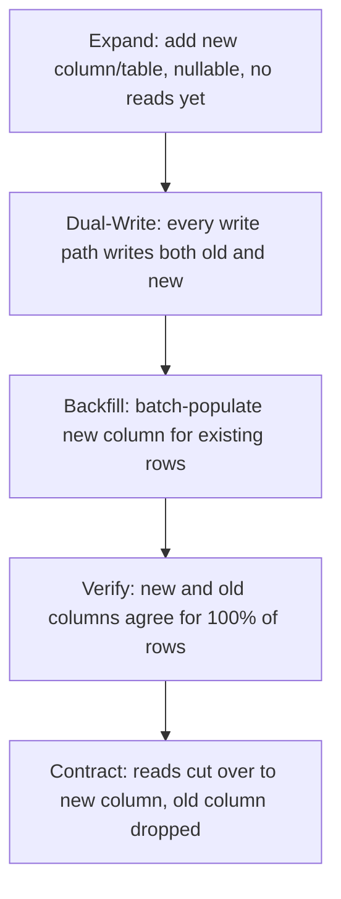
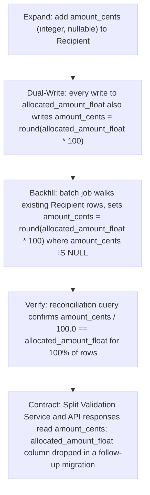

# Design Extensions

`design.md` has four conditional subsections. Each ships in the template as a
marker: a trigger question in an HTML comment, and — for features that don't
need it — an `_Not applicable: <reason>_` line explaining why and what would
make it applicable later. A marker is a valid, complete answer when the
trigger question is genuinely "no." It is not a placeholder to fill in later
out of habit.

This reference is what to read when the trigger question for one of these
four subsections is genuinely "yes" for the feature you're designing. Each
section below gives the trigger question, the full content template, and a
complete worked example — written against a payment-split-adjacent scenario
so it's obvious how to adapt each one to a real feature that actually needs
it, as opposed to the payment-split worked example in `design.md` itself,
where all four came back "not applicable."

## 1.2 Downstream Dependencies & Cross-Feature Impact

**Trigger question:** Do other features consume this data or these events?

Belongs under `## 1. Architecture & Components`, immediately after
§1.1 Component Inventory.

### Content template

A table enumerating every already-shipped feature that reads this feature's
data, subscribes to its events, or calls its API — one row per consumer,
one interface per row (a consumer using two interfaces gets two rows):

| Impacted Feature | Interface Used | Change Nature | Breaking Risk | Mitigation |
|---|---|---|---|---|
| `<feature name>` | `<event/endpoint/table + version>` | Additive \| Modifying \| Removing | None \| Low \| Medium \| High | `<concrete mitigation, or "none required"›` |

**The major-version rule.** Any breaking contract change — removing a
field, changing a field's type, changing an enum's valid values, or
tightening a previously optional field to required — requires bumping the
topic or endpoint's major version (e.g. `split.accepted` `v1` → `v2`, or
`GET /splits/{id}` `v1` → `v2`). The prior major version must keep being
published or served, unmodified, until every downstream consumer listed in
this table has migrated. This design cannot retire the legacy version
unilaterally — retirement is a separate, coordinated change gated on
confirmation from each consuming feature's owner.

An additive change (new optional field, new event with a new name, new
enum value a consumer isn't required to switch on) does not require a
version bump, but it still gets a row — additive today can become the seed
of a breaking change tomorrow, and the table is the record of who's
watching.

### Worked example

Continuing the payment-split feature, once it has shipped and two other
features have started consuming it:

| Impacted Feature | Interface Used | Change Nature | Breaking Risk | Mitigation |
|---|---|---|---|---|
| `notificacoes` | `split.accepted` event, `v1` | Additive — adds an optional `notification_channel` field (`"email"` \| `"push"`, defaults to `"email"` when absent) to let the organizer specify delivery channel per recipient | None | None required. `notificacoes` already tolerates unknown/absent optional fields per its own consumer contract; existing subscribers ignore the new field until they opt in to reading it. |
| `conciliacao-contabil` | `Split` table, direct read via `GET /splits/{id}` `v1` | Modifying — adds a nullable `external_ledger_ref` column populated only for splits created after the accounting-reconciliation integration ships; existing rows keep it `null` | Low | Phased: `conciliacao-contabil` is updated first to treat `null` as "not yet reconciled" (a state it already has to handle for splits predating the integration), then this design starts populating the column for new splits. No version bump — the field is additive to the response schema and optional in the sense that `null` is a valid, already-handled value, not an error state. |
| `conciliacao-contabil` | `split.accepted` event, `v1` | None — subscribes read-only, no field changes to its consumed fields (`split_id`, `payment_id`, `recipients`, `total_allocation_percent`) | None | None required. Listed for completeness since `conciliacao-contabil` is a dependent of two interfaces, not because this change touches the event. |

If either row above involved removing or retyping a field already read by a
consumer, the interface's major version would bump (`split.accepted` `v1` →
`v2`), `v1` would keep publishing unchanged until both `notificacoes` and
`conciliacao-contabil` confirmed migration to `v2`, and this table would
carry a `Migration deadline` note per affected row.

## 3.3 UI & Client-Side Architecture

**Trigger question:** Does this feature have a user interface?

Belongs under `## 3. Contracts`, after §3.2 Event Contracts.

### Content template

**Component Architecture & Design System**
- Primary components: a short list, each with its responsibility (not a
  full component tree — the pieces a reviewer needs to locate the UI in
  the codebase and understand what talks to what).
- Design system tokens referenced: spacing, color, and typography *as
  tokens* (e.g. `space-4`, `color-danger-500`, `text-body-sm`), never
  hardcoded values (no `16px`, no `#D92D20`) — a design that hardcodes
  values instead of referencing tokens can't be re-themed and isn't
  actually specifying the design system, just one instance of it.

**Screen States & Visual Contracts** — a table of the five mandatory
states. Every UI-bearing feature must account for all five; a state with
no meaningful difference from another still gets a row saying so (e.g.
"same as Idle" is a valid entry, an absent row is not):

| State | Visual Representation | Trigger |
|---|---|---|
| Idle / Pristine | `<what renders before any interaction>` | `<what causes this state>` |
| Loading / Fetching | `<what renders>` | `<what causes this state>` |
| Success / Completed | `<what renders>` | `<what causes this state>` |
| Empty State | `<what renders>` | `<what causes this state>` |
| Error / Validation | `<what renders>` | `<what causes this state>` |

**Client Navigation & Route Guards**

| Route Path | Route Guard | Unsaved-Changes Policy |
|---|---|---|
| `<path, e.g. /payments/:id/split-config>` | `<auth/permission check, or "none">` | `<what happens if the user navigates away mid-edit>` |

### Worked example

The payment-split configuration screen, as it would be specified if the
Organizer Web Form in the payment-split design were built out as a
stateful client instead of the thin pass-through form the actual worked
example describes:

**Component Architecture & Design System**

- **Split Table** — renders one row per recipient (`recipient_name`,
  `allocation_percent`), supports inline edit of `allocation_percent` and
  row removal; re-renders the running total on every keystroke.
- **Allocation Input** — a per-row numeric field constrained to the
  `[0.01, 100.00]` range from the `SubmitSplit` request schema (§3.1);
  rejects non-numeric input at the keystroke level rather than only on
  submit.
- **Allocation Total Banner** — a persistent summary showing
  `total_allocation_percent` against the 100% ceiling; switches to the
  Error visual treatment the instant the running total exceeds 100%,
  ahead of any server round-trip.
- **Submit Bar** — holds the "Confirm Split" action; disabled whenever the
  client-side total exceeds 100% or fewer than 2 recipients are present,
  mirroring BR-01 and BR-02 without waiting for a server response.

Design system tokens referenced: `space-4` (row padding), `space-2`
(inter-field gap), `color-border-default` (table borders),
`color-danger-500` (over-100% banner and invalid-input outline),
`color-success-500` (confirmation banner), `text-body-md` (row text),
`text-label-sm` (field labels), `radius-md` (input corners).

**Screen States & Visual Contracts**

| State | Visual Representation | Trigger |
|---|---|---|
| Idle / Pristine | Split Table with one empty recipient row pre-seeded, Allocation Total Banner reading "0% of 100% allocated" in neutral `color-text-secondary`, Submit Bar disabled | Screen first loads for a payment with no existing `pending` Split |
| Loading / Fetching | Split Table replaced by a 3-row skeleton loader, Submit Bar disabled, no banner shown | `SubmitSplit` request in flight after the organizer taps "Confirm Split" |
| Success / Completed | Split Table becomes read-only, Allocation Total Banner switches to `color-success-500` reading "100% allocated — split confirmed", Submit Bar replaced by a "Split Confirmed" badge | `SubmitSplit` returns `201` (AC-02) |
| Empty State | Split Table shows a single dashed-border placeholder row reading "Add a recipient to begin", Allocation Total Banner hidden, Submit Bar disabled | All recipient rows have been removed by the organizer, or the screen loads for a payment with zero recipients pre-populated |
| Error / Validation | Allocation Total Banner switches to `color-danger-500` reading "Total allocation cannot exceed 100%" when the client-side sum exceeds 100%; on a `422` response, the same banner instead surfaces the server's `message` (e.g. "this payment already has an accepted split" for `SPLIT_ALREADY_ACCEPTED`), and the offending row(s) get a `color-danger-500` outline | Client-side sum exceeds 100% before submit, or `SubmitSplit` returns `422` (AC-01, AC-03, AC-04) |

**Client Navigation & Route Guards**

| Route Path | Route Guard | Unsaved-Changes Policy |
|---|---|---|
| `/payments/:paymentId/split-config` | Requires `splits:write` scope (§5) for the authenticated actor; redirects to `/payments/:paymentId` with a permission-denied toast if absent | If the organizer navigates away with unsaved recipient edits, a confirmation dialog blocks the navigation until they choose "Discard changes" or "Stay on page" — the in-progress Split remains `pending` server-side either way, and resuming the route reloads it (no client-local persistence beyond the open tab) |

## 3.4 Zero-Downtime Migration Lifecycle

**Trigger question:** Does this change a schema that is already live?

Belongs under `## 3. Contracts`, after §3.3 (or after §3.2 if §3.3 is not
applicable).

### Content template

The Expand → Dual-Write → Backfill → Contract pattern, shown as a diagram
plus a concrete, column-level plan — naming the real columns involved and
what happens to each one in each phase. The abstract pattern alone is not
sufficient; a reviewer must be able to see exactly which column is added,
which is dual-written, which is backfilled, and which is dropped.

Per-phase column plan:

| Phase | What happens | Read path during this phase | Write path during this phase |
|---|---|---|---|
| Expand | `<new column/table added, nullable, unindexed reads>` | `<still reads old column>` | `<still writes only old column>` |
| Dual-Write | `<application code updated>` | `<still reads old column>` | `<writes both old and new column, same transaction>` |
| Backfill | `<batch job populates new column for pre-existing rows>` | `<still reads old column>` | `<dual-write continues for new rows>` |
| Verify | `<comparison job/query confirms old == new for all rows>` | `<still reads old column>` | `<dual-write continues>` |
| Contract | `<old column dropped or deprecated>` | `<cuts over to new column>` | `<writes only new column>` |

### Worked example

Migrating the payment-split `Recipient` schema from a legacy
`allocated_amount_float` column to a new `amount_cents` integer column, to
eliminate floating-point rounding drift in allocation totals:

Per-phase column plan for `Recipient.allocated_amount_float` →
`Recipient.amount_cents`:

| Phase | What happens | Read path during this phase | Write path during this phase |
|---|---|---|---|
| Expand | `amount_cents` (integer, nullable, no default) added to the `Recipient` table via an online schema-change migration; no application code changes yet | Split Validation Service and `SubmitSplit`/`GET /splits/{id}` responses read `allocated_amount_float` only, unchanged | Only `allocated_amount_float` is written |
| Dual-Write | `Split Store`'s recipient-write path updated: every insert/update of a `Recipient` computes `amount_cents = round(allocated_amount_float * 100)` and writes both columns in the same transaction | Still reads `allocated_amount_float` only — `amount_cents` is not yet trusted for any existing row | New and updated rows carry both columns; rows untouched since before this phase still have `amount_cents = NULL` |
| Backfill | A one-time batch job iterates `Recipient` rows where `amount_cents IS NULL`, computing and setting `amount_cents = round(allocated_amount_float * 100)` in small batches to avoid long locks | Still reads `allocated_amount_float` only | Dual-write from the previous phase continues unchanged for any new writes that land mid-backfill |
| Verify | A reconciliation query checks, for every `Recipient` row, that `amount_cents = round(allocated_amount_float * 100)`; any mismatch blocks progression to Contract and is investigated as a data-integrity bug, not silently overwritten | Still reads `allocated_amount_float` only | Dual-write continues |
| Contract | Split Validation Service's total-allocation check and both API response schemas (§3.1) switch to reading `amount_cents`; `total_allocation_percent` in requests/responses is derived from `amount_cents` instead of `allocated_amount_float`; a follow-up migration (tracked as a separate change, not part of this design) drops `allocated_amount_float` once no code path references it | Reads `amount_cents` exclusively | Writes `amount_cents` exclusively; `allocated_amount_float` write path removed from `Split Store` |

The Contract phase's schema drop is deliberately a separate, later change —
this design's own rollout only needs to reach "reads and writes exclusively
use `amount_cents`"; deleting the now-dead `allocated_amount_float` column
is safe to schedule independently once nothing references it.

## 6.2 Feature Flag Configuration

**Trigger question:** Is this rolled out behind a flag?

Belongs under `## 6. Observability`, after §6.1 Logs & Metrics.

### Content template

| Field | Value |
|---|---|
| Flag Key | `<exact flag key as it appears in the flag service>` |
| Default State | `on` \| `off` |
| Evaluation Strategy | `<e.g. percentage rollout by a specific id, allowlist, both>` |
| Fallback Behavior | `<what the system does if the flag service is unreachable at evaluation time>` |
| Retirement / Cleanup Milestone | `<condition + owner + tracking reference that triggers removing the flag and its dead branch>` |

A flag entry without a fallback behavior is incomplete — "the flag service
is unreachable" is itself a failure mode this design must specify a
response to, not an unstated assumption that the service is always up.

### Worked example

Gating a payment-split-v2 allocation engine (supporting weighted-by-role
splits, not just flat percentages) behind a flag during rollout:

| Field | Value |
|---|---|
| Flag Key | `enable_payment_split_v2` |
| Default State | `off` |
| Evaluation Strategy | Percentage rollout keyed on `tenant_id` (stable hash, so a given tenant always evaluates the same way for the duration of a rollout stage), staged as: 10% of tenants for the first 7 days, 50% for the next 7 days if no `split.rejected` rate regression is observed, then 100% |
| Fallback Behavior | If the flag service is unreachable at evaluation time, the evaluation defaults to `off` (single-recipient payout via the legacy v1 allocation path) rather than failing the request — a payment must always resolve to *some* valid payout even if the v2 engine can't be reached |
| Retirement / Cleanup Milestone | 30 days after reaching and holding 100% rollout with no rollback, the `enable_payment_split_v2` flag and the legacy v1-only code branch it guards are removed in a dedicated cleanup change, tracked as ticket `PAY-4821` |
