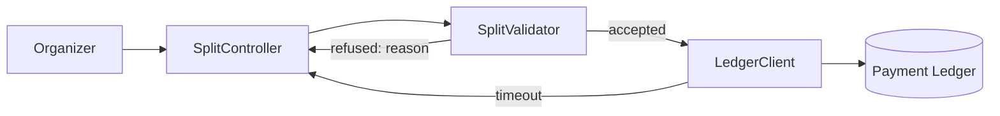
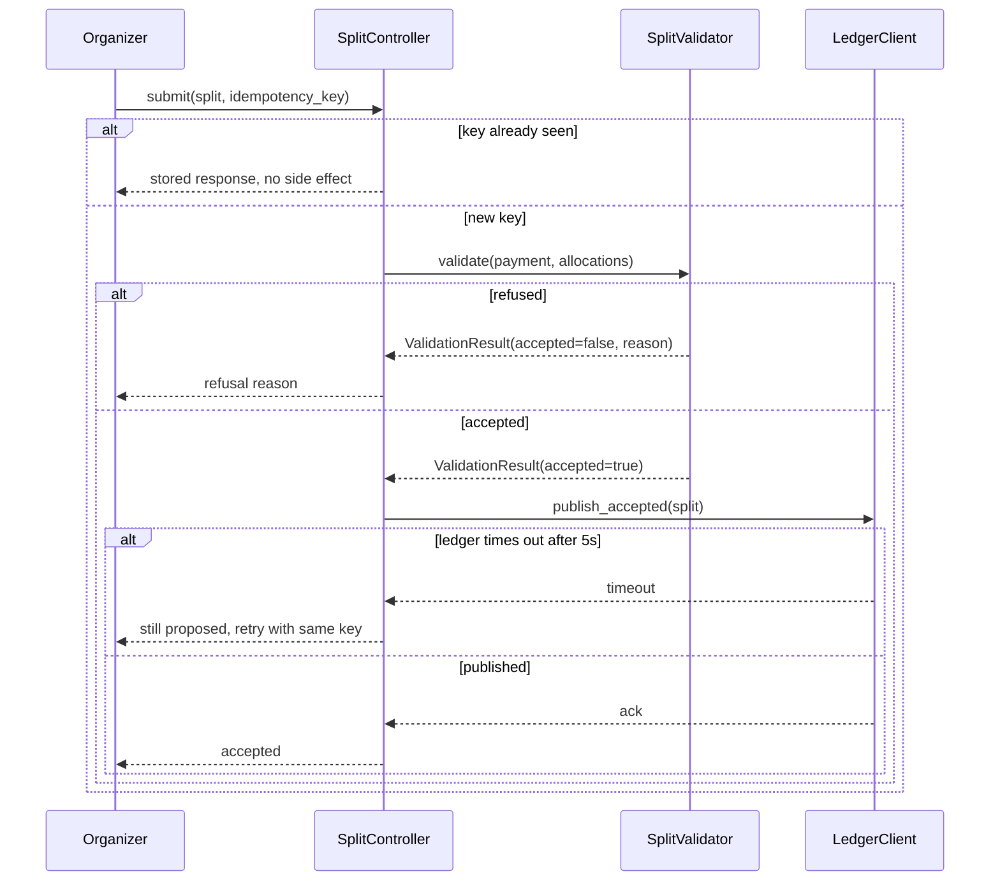

<!--
HOW the capability in spec_ref is built. Every business rule and edge case in
the spec is answered here by a contract, a flow, or an explicit deferral.

Two rules this file lives or dies by:

1. Never name a file or a symbol by description. Not "the split service" —
   src/payments/split_validator.py. Not "the validation function" —
   validate_split(payment, allocations). Tasks are executed by fresh subagents
   with no session memory, often small models; a description they cannot
   resolve becomes a plausible invention.
2. Budget 250 lines. Contracts and the file map earn their room; narrative does
   not. Cut prose before cutting precision.

Sections 1.2, 3.3, 3.4 and 6.2 are conditional — see references/design-extensions.md
for what triggers each. A conditional section that does not apply is marked
_Not applicable: <reason>_ and never silently dropped.

A filled-in example lives in the repository, at
tests/golden/payment-split/.specs/features/payment-split/design.md. It is not
copied by a manual install and is not needed to use this template - the worked
example below is complete on its own.
-->

## 0. At a Glance

<!-- Persisted 15-line summary; hard cap, linted. Never scored by the judge. -->

A validation service checks a proposed split before anything reaches the
ledger, and returns the specific reason when it refuses one. Submissions carry
a caller-supplied key so a retried submission settles exactly once.

Not covered here: currency conversion, scheduled splits.

Nothing open.

## 1. Architecture & Components

### 1.1 Component Inventory

| Component | Symbol | Responsibility | Talks to |
|---|---|---|---|
| Split Validator | `SplitValidator` in `src/payments/split_validator.py` | Applies BR-01..BR-03 and returns an accept or a reason | Split Controller |
| Split Controller | `SplitController` in `src/payments/split_controller.py` | Accepts submissions, enforces idempotency, calls the validator | Validator, Ledger Client |
| Ledger Client | `LedgerClient` in `src/payments/ledger_client.py` | Sends accepted splits to the payment ledger | Payment Ledger |

<!-- One diagram, from the permitted set in references/artifact-design.md. Cap 12 nodes; over cap it is dropped, not shrunk. -->

### 1.2 Downstream Dependencies & Cross-Feature Impact

_Not applicable: this capability is additive and no existing consumer reads split state._

## 2. Data Model

### 2.1 Schemas

| Field | Type | Constraint |
|---|---|---|
| `payment_id` | uuid | required, references `payments.id` |
| `recipient_id` | uuid | required |
| `allocation_pct` | decimal(5,2) | required, > 0, <= 100 |
| `idempotency_key` | varchar(64) | required, unique per `payment_id` |
| `state` | enum | one of `proposed`, `accepted`, `refused` |

Table: `payment_splits`, new. Migration `db/migrations/001_payment_splits.sql`.
Backward compatible: additive table, no change to `payments`.

### 2.2 State Machine

`proposed` -> `accepted` on validation success; `proposed` -> `refused` on any
BR violation. `accepted` and `refused` are terminal.

## 3. Contracts

### 3.1 API Contracts

`SplitValidator.validate(payment: Payment, allocations: list[Allocation]) -> ValidationResult`

| Outcome | Shape |
|---|---|
| accepted | `ValidationResult(accepted=True, reason=None)` |
| refused | `ValidationResult(accepted=False, reason: RefusalReason)` |

`RefusalReason` is an enum in `src/payments/errors.py`: `TOTAL_EXCEEDS_100`,
`TOO_FEW_RECIPIENTS`, `NON_POSITIVE_ALLOCATION`, `MALFORMED_ALLOCATION`,
`PAYMENT_WINDOW_CLOSED`, `SPLIT_ALREADY_ACCEPTED`.

### 3.2 Event Contracts

`SplitAccepted` published by `LedgerClient.publish_accepted`, payload
`{payment_id: uuid, allocations: [{recipient_id: uuid, allocation_pct: decimal}], accepted_at: timestamp}`.

### 3.3 UI & Client-Side Architecture

_Not applicable: this release exposes no new client surface; the existing checkout form submits the split._

### 3.4 Zero-Downtime Migration Lifecycle

_Not applicable: the migration adds a table no running code reads yet._

## 4. Interaction Flows

<!--
Every flow states its failure branches. A flow with only a happy path scores
zero on the Tier 2 interaction criterion.
-->

| Flow | Happy path | Failure branches |
|---|---|---|
| Submit a split | Controller checks the idempotency key, validator applies BR-01..BR-03, ledger client publishes | Duplicate key returns the first result unchanged; validator refusal returns the reason without calling the ledger; ledger timeout leaves the split `proposed` and the submission retriable |
| Concurrent submissions (EC-02) | First writer wins on the unique `payment_id` constraint | Second write fails the constraint and is refused with `SPLIT_ALREADY_ACCEPTED`, not a generic error |

<!--
The second and last diagram. Participants are the real symbols from §1.1, cap
8, and the failure branches are drawn — a sequence with only a happy path is
the thing §4 exists to prevent.
-->

## 5. Resilience & Security

| Concern | Decision |
|---|---|
| Idempotency | Caller-supplied key, unique per payment, per ADR-0002 |
| Ledger timeout | 5s, then the split stays `proposed` and the caller may retry with the same key |
| Retries | Ledger publish retries 3 times with exponential backoff; validation never retries |
| Authorization | Only the payment's organizer may submit a split for it |

## 6. Observability

### 6.1 Logs & Metrics

| Signal | Emitted by | Why |
|---|---|---|
| `split.refused` counter, tagged by `RefusalReason` | `SplitValidator.validate` | Feeds the spec's "splits refused for allocation errors" metric |
| `split.ledger_publish_ms` histogram | `LedgerClient.publish_accepted` | Detects the timeout branch before it becomes a support ticket |

### 6.2 Feature Flag Configuration

_Not applicable: released without a flag; the capability is additive and reversible by migration._

## 7. ADR Conformance

| ADR | How this design complies |
|---|---|
| ADR-0002 | `idempotency_key` is caller-supplied and unique per `payment_id`, exactly as the ADR's compliance check specifies |

## 8. Traceability

| Spec id | Answered by |
|---|---|
| BR-01 | `SplitValidator.validate`, §3.1 |
| BR-02 | `SplitValidator.validate`, §3.1 |
| BR-03 | `SplitValidator.validate`, §3.1 |
| EC-01 | §3.1 boundary is inclusive (`<= 100`) |
| EC-02 | §4 concurrent-submission flow |
| EC-03 | `PAYMENT_WINDOW_CLOSED`, §3.1 |
| EC-04 | `MALFORMED_ALLOCATION`, checked before totals, §3.1 |

## 9. File Map

<!--
Every file the feature touches, by literal repo-relative path. A file that does
not exist yet is still written out in full — the task that creates it needs to
be told exactly where. This table is what tasks.md's [files: ...] tags draw on,
and what keeps a small executing model from inventing a path.
-->

| Path | Holds | Status |
|---|---|---|
| `src/payments/split_validator.py` | `SplitValidator`, BR-01..BR-03 | new |
| `src/payments/split_controller.py` | `SplitController`, idempotency handling | new |
| `src/payments/ledger_client.py` | `LedgerClient.publish_accepted` | new |
| `src/payments/errors.py` | `RefusalReason` enum | modified |
| `db/migrations/001_payment_splits.sql` | `payment_splits` table | new |
| `tests/payments/test_split_validator.py` | AC-01..AC-04, EC-01, EC-04 | new |
| `tests/payments/test_split_controller.py` | EC-02, EC-03, idempotency | new |

## 10. Change Log

| Version | Date | Change | Gate score |
|---|---|---|---|
| 1.0.0 | 2026-08-18 | Initial design: validator, controller, ledger client, idempotency per ADR-0002 | 92 |
