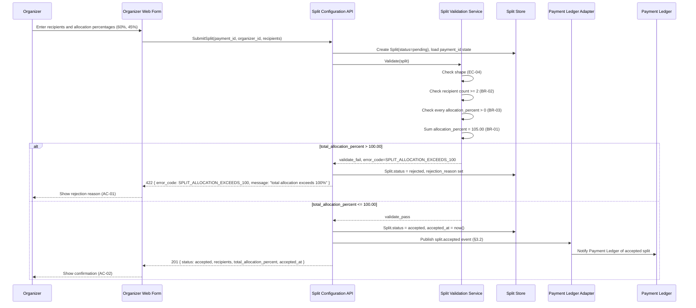

<!--
This is the implementation contract. It describes HOW the system satisfies
the WHAT/WHY already agreed in spec.md: components, schemas, wire contracts,
flows, resilience numbers, and observability — all typed and concrete, none
of it "reasonable" or "as appropriate." Where the spec forbids technology
names, this file requires them: a design that could describe any stack isn't
a design yet, it's a restatement of the spec.

This worked example continues the payment-split feature from spec.md
(SPEC-FEAT-001) verbatim — same BR-01..03, AC-01..04, EC-01..04 ids. Replace
the example content with your own feature's content; keep the headings and
table columns exactly as they are — this file is linted against
skills/sdd/scripts/rules.json and the section headings must match verbatim.
-->

## 1. Architecture & Components

### 1.1 Component Inventory

| Component | Responsibility | Depends on |
|---|---|---|
| Split Configuration API | Accepts a split submission for a payment, orchestrates validation and persistence, and returns acceptance or a domain error (§3.1) | Split Validation Service, Split Store |
| Split Validation Service | Applies BR-01, BR-02, BR-03 (and the shape check for EC-04) to a submitted split before it can transition to `accepted` | Split Store |
| Split Store | Persists Split and Recipient records and enforces the state machine transitions in §2.2 | — |
| Payment Ledger Adapter | Publishes the `split.accepted` event (§3.2) to the Payment Ledger once a split reaches `accepted`, per the retry policy in §5 | Split Store |
| Organizer Web Form | Collects recipients and allocation percentages from the organizer and renders the rejection reason returned by §3.1 on failure | Split Configuration API |

### 1.2 Downstream Dependencies & Cross-Feature Impact

<!-- Trigger: does an already-shipped feature consume this feature's data, events, or behavior? -->

_Not applicable: payment-split is a new capability with no existing feature
currently consuming split data or the `split.accepted` event; there is no
downstream consumer yet to assess for cross-feature impact. Revisit this
subsection the first time another feature integrates against the Split
Configuration API or subscribes to `split.accepted`._

## 2. Data Model

### 2.1 Schemas

**Split**

| Field | Type | Nullable | Notes / Indexes |
|---|---|---|---|
| id | string (UUID v4) | no | Primary key |
| payment_id | string (UUID v4) | no | Foreign key to Payment; indexed. A partial unique index enforces at most one row with `payment_id = X AND status = 'accepted'` (EC-02) |
| organizer_id | string (UUID v4) | no | Foreign key to Actor (Organizer) |
| status | enum: `pending`, `accepted`, `rejected`, `expired` | no | Indexed; governed by the state machine in §2.2 |
| total_allocation_percent | decimal(5,2) | no | Sum of `recipients[].allocation_percent` at validation time; valid range 0.01–100.00 |
| rejection_reason | string, max 200 chars | yes | Set only when `status = rejected`; one of the values enumerated in §3.1's error schema |
| created_at | timestamp (ISO 8601, UTC) | no | — |
| expires_at | timestamp (ISO 8601, UTC) | no | `created_at + 15 minutes`, enforced by EC-03 |
| accepted_at | timestamp (ISO 8601, UTC) | yes | Set only when `status = accepted` |

**Recipient** (child of Split)

| Field | Type | Nullable | Notes / Indexes |
|---|---|---|---|
| id | string (UUID v4) | no | Primary key |
| split_id | string (UUID v4) | no | Foreign key to Split; indexed |
| recipient_name | string, max 100 chars | no | — |
| allocation_percent | decimal(5,2) | no | Valid range 0.01–100.00 (exclusive of 0), per BR-03 |

### 2.2 State Machine

| From | Event | To | Guard |
|---|---|---|---|
| (none) | `submit_split` | `pending` | Payload passes shape validation — every `allocation_percent` parses as a decimal in `[0.01, 100.00]` (EC-04) |
| `pending` | `validate_pass` | `accepted` | `total_allocation_percent <= 100.00` (BR-01) AND `count(recipients) >= 2` (BR-02) AND every `recipients[].allocation_percent > 0` (BR-03) AND no other Split for the same `payment_id` already has `status = accepted` (EC-02) |
| `pending` | `validate_fail` | `rejected` | Inverse of `validate_pass`; `rejection_reason` is set to the first rule that fails, evaluated in this fixed order: EC-04 shape → BR-02 count → BR-03 positivity → BR-01 total → EC-02 duplicate-accepted |
| `pending` | `window_elapsed` | `expired` | `now() > expires_at` while `status` is still `pending` (EC-03) |
| `accepted` | — | — | Terminal state |
| `rejected` | — | — | Terminal state |
| `expired` | — | — | Terminal state |

## 3. Contracts

### 3.1 API Contracts

**Request — `SubmitSplit`**

```json
{
  "type": "object",
  "required": ["payment_id", "organizer_id", "recipients"],
  "properties": {
    "payment_id": {
      "type": "string",
      "format": "uuid"
    },
    "organizer_id": {
      "type": "string",
      "format": "uuid"
    },
    "recipients": {
      "type": "array",
      "minItems": 2,
      "maxItems": 20,
      "items": {
        "type": "object",
        "required": ["recipient_name", "allocation_percent"],
        "properties": {
          "recipient_name": {
            "type": "string",
            "minLength": 1,
            "maxLength": 100
          },
          "allocation_percent": {
            "type": "number",
            "exclusiveMinimum": 0,
            "maximum": 100
          }
        }
      }
    }
  }
}
```

**Response — 201 (accepted)**

```json
{
  "type": "object",
  "required": ["id", "payment_id", "status", "recipients", "total_allocation_percent", "accepted_at"],
  "properties": {
    "id": { "type": "string", "format": "uuid" },
    "payment_id": { "type": "string", "format": "uuid" },
    "status": { "type": "string", "enum": ["accepted"] },
    "recipients": {
      "type": "array",
      "items": {
        "type": "object",
        "required": ["recipient_name", "allocation_percent"],
        "properties": {
          "recipient_name": { "type": "string" },
          "allocation_percent": { "type": "number" }
        }
      }
    },
    "total_allocation_percent": { "type": "number", "maximum": 100 },
    "accepted_at": { "type": "string", "format": "date-time" }
  }
}
```

**Error schema — 422 (rejected)**

```json
{
  "type": "object",
  "required": ["error_code", "message"],
  "properties": {
    "error_code": {
      "type": "string",
      "enum": [
        "SPLIT_ALLOCATION_EXCEEDS_100",
        "SPLIT_MIN_RECIPIENTS_NOT_MET",
        "SPLIT_ZERO_ALLOCATION",
        "SPLIT_INVALID_ALLOCATION_VALUE",
        "SPLIT_ALREADY_ACCEPTED",
        "SPLIT_PAYMENT_WINDOW_EXPIRED"
      ]
    },
    "message": {
      "type": "string",
      "maxLength": 200
    },
    "details": {
      "type": "array",
      "items": {
        "type": "object",
        "required": ["recipient_index", "issue"],
        "properties": {
          "recipient_index": { "type": "integer", "minimum": 0 },
          "issue": { "type": "string", "maxLength": 100 }
        }
      }
    }
  }
}
```

Domain error code mapping (traces to §6 of the spec):

| error_code | Proves | Example `message` |
|---|---|---|
| `SPLIT_ALLOCATION_EXCEEDS_100` | AC-01 / BR-01 | "total allocation exceeds 100%" |
| `SPLIT_MIN_RECIPIENTS_NOT_MET` | AC-03 / BR-02 | "a split requires at least two recipients" |
| `SPLIT_ZERO_ALLOCATION` | AC-04 / BR-03 | "every recipient must have an allocation greater than 0%" |
| `SPLIT_INVALID_ALLOCATION_VALUE` | EC-04 | "recipient 1's allocation is not a valid percentage" |
| `SPLIT_ALREADY_ACCEPTED` | EC-02 | "this payment already has an accepted split" |
| `SPLIT_PAYMENT_WINDOW_EXPIRED` | EC-03 | "this payment is no longer open for splitting" |

### 3.2 Event Contracts

**`split.accepted`** — published by the Payment Ledger Adapter once a Split transitions to `accepted`.

```json
{
  "type": "object",
  "required": ["event_id", "occurred_at", "schema_version", "split_id", "payment_id", "recipients", "total_allocation_percent"],
  "properties": {
    "event_id": { "type": "string", "format": "uuid" },
    "occurred_at": { "type": "string", "format": "date-time" },
    "schema_version": { "type": "string", "enum": ["1.0"] },
    "split_id": { "type": "string", "format": "uuid" },
    "payment_id": { "type": "string", "format": "uuid" },
    "recipients": {
      "type": "array",
      "items": {
        "type": "object",
        "required": ["recipient_name", "allocation_percent"],
        "properties": {
          "recipient_name": { "type": "string" },
          "allocation_percent": { "type": "number" }
        }
      }
    },
    "total_allocation_percent": { "type": "number", "maximum": 100 }
  }
}
```

No event is published for `rejected` or `expired` transitions — those are
local outcomes returned synchronously in the §3.1 response and have no
downstream consumer per §1.2.

### 3.3 UI & Client-Side Architecture

<!-- Trigger: does this feature have a user interface? -->

_Not applicable: the Organizer Web Form is a thin, stateless input over the
contract in §3.1 — it collects `recipients` and `allocation_percent` values
and renders whichever `error_code`/`message` §3.1 returns. It introduces no
client-side state machine, local caching, or offline behavior beyond what
§3.1 already specifies, so a dedicated client architecture section is not
warranted at this scope. Revisit if the form grows optimistic-update, draft
persistence, or offline-queue behavior._

### 3.4 Zero-Downtime Migration Lifecycle

<!-- Trigger: does this design change or replace an existing live schema or contract? -->

_Not applicable: this design introduces the Split and Recipient schemas
(§2.1) for the first time — there is no prior version of these resources, no
live rows, and no existing client contract to migrate away from. Revisit
this subsection the first time a released version of these schemas needs a
breaking change._

## 4. Interaction Flows



## 5. Resilience & Security

**Idempotency key strategy.** The client supplies an `Idempotency-Key`
header (UUID v4) with every `SubmitSplit` call. The Split Configuration API
stores the key alongside the resulting Split id for 24 hours; a repeated
request carrying the same key within that window returns the original
response instead of creating a second Split, closing the concurrent
double-submit gap described in EC-02 at the API layer, ahead of the
database-level unique index in §2.1.

**RBAC scopes.** `splits:write` is required to call `SubmitSplit` (granted
to the Organizer actor only). `splits:read` is required to read a Split,
scoped so a Recipient can only read a Split containing their own
`recipient_name`. The Payment Ledger Adapter authenticates with the service
scope `splits:events:publish`.

**Retry policy.** The Payment Ledger Adapter retries a failed
`split.accepted` publish up to 5 times, with exponential backoff starting
at 500ms and doubling each attempt, capped at 8000ms between attempts.

**Timeouts.** Split Configuration API → Split Validation Service: 3000ms.
Split Configuration API → Split Store: 2000ms per query. Payment Ledger
Adapter → Payment Ledger publish call: 4000ms.

**Circuit breaker.** The Payment Ledger Adapter opens its circuit after 10
consecutive publish failures within a 60-second window, stays open for
30 seconds, then permits exactly 1 half-open trial request before either
closing (on success) or reopening for another 30 seconds (on failure).

## 6. Observability

### 6.1 Logs & Metrics

Structured log fields (emitted as one JSON line per transition):

| Field | Example |
|---|---|
| `event` | `split_submitted` \| `split_accepted` \| `split_rejected` \| `split_expired` |
| `split_id` | `3fa2...` |
| `payment_id` | `9c11...` |
| `organizer_id` | `7ab0...` |
| `recipient_count` | `2` |
| `total_allocation_percent` | `105.00` |
| `error_code` | `SPLIT_ALLOCATION_EXCEEDS_100` (present only when `event = split_rejected`) |
| `latency_ms` | `42` |

Metric keys:

| Metric | Type | Labels |
|---|---|---|
| `split.submitted.count` | counter | — |
| `split.accepted.count` | counter | — |
| `split.rejected.count` | counter | `error_code` |
| `split.expired.count` | counter | — |
| `split.validation.latency_ms` | histogram | — |
| `split.ledger_publish.failure.count` | counter | — |

### 6.2 Feature Flag Configuration

<!-- Trigger: is this feature releasing behind a flag or a gradual rollout? -->

_Not applicable: this capability ships fully enabled behind the existing
`splits:write` / `splits:read` RBAC scopes (§5), with no gradual rollout or
kill-switch requirement. BR-01..BR-03 are correctness rules, not an
experiment; gating them behind a flag would only mask a defect rather than
control a rollout. Revisit if a phased rollout to a subset of organizers is
requested._

## 7. ADR Conformance

| ADR id | Rule it imposes | How this design satisfies it |
|---|---|---|
| ADR-0002 | External-facing write APIs must accept a client-supplied idempotency key so retried requests cannot create duplicate side effects | §5's idempotency key strategy: `SubmitSplit` requires an `Idempotency-Key` header, and a replay within 24 hours returns the original response instead of creating a second Split |

## 8. Traceability

| BR/EC id | Component / contract / flow that implements it |
|---|---|
| BR-01 | Split Validation Service (§1.1); state machine `validate_pass`/`validate_fail` guard (§2.2); `SPLIT_ALLOCATION_EXCEEDS_100` error (§3.1); rejection branch of §4 sequence diagram |
| BR-02 | Split Validation Service (§1.1); `recipients` `minItems: 2` in the §3.1 request schema; `SPLIT_MIN_RECIPIENTS_NOT_MET` error (§3.1) |
| BR-03 | Split Validation Service (§1.1); `allocation_percent` `exclusiveMinimum: 0` in the §3.1 request schema; `SPLIT_ZERO_ALLOCATION` error (§3.1) |
| EC-01 | `total_allocation_percent <= 100.00` guard on `validate_pass` (§2.2) — 100.00 is inclusive |
| EC-02 | Partial unique index on `payment_id` + `status = accepted` (§2.1); idempotency key strategy (§5); `SPLIT_ALREADY_ACCEPTED` error (§3.1) |
| EC-03 | `expires_at` field and `window_elapsed` transition (§2.2); `SPLIT_PAYMENT_WINDOW_EXPIRED` error (§3.1) |
| EC-04 | Request schema constraints on `allocation_percent` (§3.1); shape check as the first guard evaluated in `validate_fail` (§2.2); `SPLIT_INVALID_ALLOCATION_VALUE` error (§3.1) |

## 9. Change Log

| Version | Date | Change | Gate score |
|---|---|---|---|
| 1.0.0 | 2026-08-18 | Initial design covering the Split/Recipient schema, SubmitSplit contract, split.accepted event, and the validation state machine for BR-01..03 and EC-01..04 | 0.75 |
