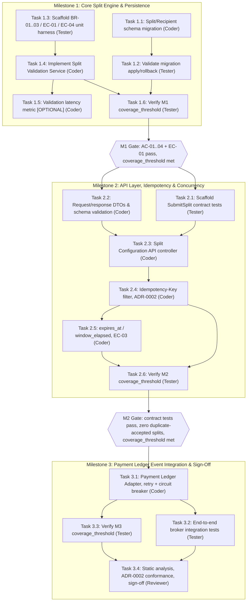

<!--
This is the execution contract. It describes WHO builds WHAT, in WHICH
order, with WHICH quality gates — turning spec.md's WHAT/WHY and design.md's
HOW into a concurrency-aware delivery schedule that tasks.md then tracks
task-by-task. It must never invent new business rules or contracts: every
milestone, harness, and gate here must trace back to an existing BR/AC/EC id
in spec.md or a component/contract in design.md.

CRITICAL: no model id is ever hardcoded in this file — not in
`allocated_agents`, not in §4's table. Model selection per role is resolved
at plan time per the order documented above and in
references/artifact-plan-tasks.md. A plan that ships with a literal model
id (e.g. a specific Claude or GPT version string) instead of a resolved
token is not complete.

This worked example continues the payment-split feature from spec.md
(SPEC-FEAT-001) and design.md (DESIGN-FEAT-001) verbatim — same BR-01..03,
AC-01..04, EC-01..04 ids, and the same components and contracts (Split
Configuration API, Split Validation Service, Split Store, Payment Ledger
Adapter, SubmitSplit, split.accepted). Replace the example content with your
own feature's content; keep the headings exactly as they are — this file is
linted against skills/sdd/scripts/rules.json and the section headings must
match verbatim.
-->

# Execution Plan: Payment Split Engine

## 1. Delivery Milestones & Scope Breakdown

<!--
Each milestone is a vertically-sliced, independently testable increment of
business value — never a horizontal technical layer (see
references/artifact-plan-tasks.md, principle 1 and the milestone-derivation
guidance). Gating criteria must cite real AC/EC ids from spec.md or real
contracts/sections from design.md.
-->

| Milestone / Sprint | Scope & Value Delivered | Target Outcome | Gating Criteria |
|---|---|---|---|
| Milestone 1 (M1) | Core Split Engine & Persistence — Split/Recipient schema (design §2.1) and the Split Validation Service enforcing BR-01, BR-02, BR-03 | Recipients and allocations can be validated and persisted end-to-end against a Split row, without the API surface yet | AC-01, AC-02, AC-03, AC-04, and EC-01 (100% boundary) pass against the unit test harness; Milestone 1's coverage_threshold is met |
| Milestone 2 (M2) | API Layer, Idempotency & Concurrency Protection — Split Configuration API (SubmitSplit contract, §3.1), Idempotency-Key handling per ADR-0002, and the EC-02/EC-03 guards | Organizers can submit a split over the public contract exactly once per Idempotency-Key, with malformed input (EC-04) and expired payments (EC-03) rejected before any business rule runs | Contract test suite for §3.1's request/response/error schemas passes; zero duplicate-accepted splits under a concurrent-submission test (EC-02); Milestone 2's coverage_threshold is met |
| Milestone 3 (M3) | Payment Ledger Event Integration & Sign-Off — Payment Ledger Adapter publishing `split.accepted` (§3.2) with the retry policy and circuit breaker (§5), plus observability (§6.1) | An accepted split reliably reaches the Payment Ledger, survives transient publish failures, and the feature is verified compliant with ADR-0002 before release | End-to-end broker integration tests pass; ADR-0002 conformance (design §7) verified; Milestone 3's coverage_threshold is met; Reviewer sign-off recorded |

## 2. Dependency Graph & Concurrency Model (DAG)

### Concurrency Rules

* Stream 1A (Persistence: Task 1.1 → 1.2) and Stream 1B (Domain Validation: Task 1.3 → 1.4 → 1.5) execute simultaneously during Milestone 1 — neither is in the other's `depends_on` closure, and the migration files and the validation-service files do not overlap.
* Milestone 2 cannot begin until the Milestone 1 gate closes: both Task 1.2 (persistence verified) and Task 1.6 (coverage_threshold met) must be `[x]` before Task 2.1 or Task 2.2 may start.
* Within Milestone 2, Task 2.1 (contract test scaffolding) and Task 2.2 (DTO implementation) run in parallel — both depend only on Milestone 1 output, not on each other — then converge on Task 2.3 (controller wiring).
* Task 2.4 (idempotency filter) and Task 2.5 (expiry window) are deliberately sequential, not parallel, because both modify the same Split Configuration API middleware chain (§1.1 of design.md) — running them concurrently risks a merge conflict on the same files.
* Milestone 3 cannot begin until the Milestone 2 gate closes (Task 2.4, 2.5, and 2.6 all `[x]`).

## 3. Pre-Implementation Test Harness Strategy

<!-- Test suites must exist before the business logic they test — see references/artifact-plan-tasks.md, principle 5. -->

Before generating business code, automated test scaffolding must be instantiated:

* **Domain Unit Harness** (Task 1.3): assertions for BR-01 (total allocation ≤ 100%), BR-02 (≥ 2 recipients), BR-03 (every allocation > 0%), and the EC-01 boundary (exactly 100% is accepted) — one test per AC-01..AC-04 and EC-01 in spec.md §6/§7.
* **API Contract Harness** (Task 2.1): JSON Schema validation for the `SubmitSplit` request, the 201 response, and the 422 error schema (design.md §3.1), including the `error_code` enum mapping so a rejected split always returns the exact code documented for its failing rule.
* **Idempotency Verification Harness** (folded into Task 2.4's acceptance test, per ADR-0002 §7's Validation Rule): asserts that two `SubmitSplit` calls carrying the same `Idempotency-Key` return a byte-identical response and that the underlying Split row is created exactly once — verifying EC-02's duplicate-submission protection at the API layer.
* **Event Contract Harness** (Task 3.2): schema validation for the `split.accepted` event (design.md §3.2) plus a retry/circuit-breaker simulation asserting the §5 backoff (500ms doubling, capped at 8000ms) and the 10-failure/60-second circuit-open threshold.

## 4. Agent Roles & Allocation

<!--
Designated Model is never a literal model id — always the resolved token
from this plan's frontmatter `allocated_agents`. See
references/artifact-plan-tasks.md for the resolution order and how each
suggestion below would be justified once a real model is proposed.
-->

| Role Name | Designated Model | Execution Domain |
|---|---|---|
| Coder | `<model-for-implementation>` (frontmatter `allocated_agents.Coder`) | Schema migrations, Split Validation Service, Split Configuration API controller, Idempotency-Key filter, expiry handling, Payment Ledger Adapter. |
| Tester | `<model-for-test-authoring>` (frontmatter `allocated_agents.Tester`) | Unit/contract/integration test scaffolding, migration validation, coverage_threshold verification per milestone (Task 1.6, 2.6, 3.3). |
| Reviewer | `<model-for-review>` (frontmatter `allocated_agents.Reviewer`) | Static analysis, ADR-0002 conformance verification (design §7), final Milestone 3 sign-off. |
| Evaluator | `<model-for-tier-2-judge>` (frontmatter `allocated_agents.Evaluator`) | Tier-2 gate scoring of spec.md/design.md/plan.md artifacts (the Gate score recorded in each artifact's Change Log) — independent of the Coder/Tester/Reviewer execution loop. |

## 5. Circuit Breaker & Blocker Protocol

* **Self-Correction Cap:** agents are limited to 3 consecutive retry attempts on a failing test before the task is treated as blocked.
* **Blocker Escalation:** if a task cannot resolve within 3 cycles, update tasks.md to `[!]` BLOCKED, log the exact failure (error message, failing assertion, or the AC/EC id that will not pass) in the Execution Scratchpad & Blocker Log, and halt execution on that task.
* **Human Gate Requirement:** the workflow cannot proceed past any milestone gate (G1, G2 above, or Milestone 3's sign-off) until every `[REQUIRED]` item in that milestone is marked `[x]` in tasks.md — including its coverage-verification task.
