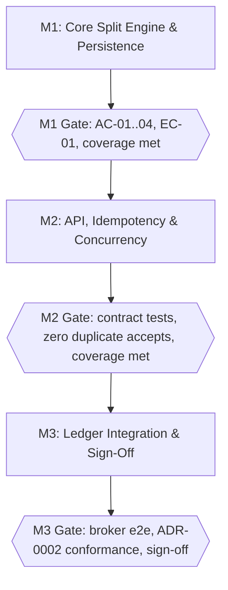

# Execution Plan: Payment Split Engine

## 1. Delivery Milestones & Scope Breakdown

| Milestone / Sprint | Scope & Value Delivered | Target Outcome | Gating Criteria |
|---|---|---|---|
| Milestone 1 (M1) | Core Split Engine & Persistence — Split/Recipient schema (design §2.1) and the Split Validation Service enforcing BR-01, BR-02, BR-03 | Recipients and allocations can be validated and persisted end-to-end against a Split row, without the API surface yet | AC-01, AC-02, AC-03, AC-04, and EC-01 (100% boundary) pass against the unit test harness; Milestone 1's coverage_threshold is met |
| Milestone 2 (M2) | API Layer, Idempotency & Concurrency Protection — Split Configuration API (SubmitSplit contract, §3.1), Idempotency-Key handling per ADR-0002, and the EC-02/EC-03 guards | Organizers can submit a split over the public contract exactly once per Idempotency-Key, with malformed input (EC-04) and expired payments (EC-03) rejected before any business rule runs | Contract test suite for §3.1's request/response/error schemas passes; zero duplicate-accepted splits under a concurrent-submission test (EC-02); Milestone 2's coverage_threshold is met |
| Milestone 3 (M3) | Payment Ledger Event Integration & Sign-Off — Payment Ledger Adapter publishing `split.accepted` (§3.2) with the retry policy and circuit breaker (§5), plus observability (§6.1) | An accepted split reliably reaches the Payment Ledger, survives transient publish failures, and the feature is verified compliant with ADR-0002 before release | End-to-end broker integration tests pass; ADR-0002 conformance (design §7) verified; Milestone 3's coverage_threshold is met; Reviewer sign-off recorded |

## 2. Dependency Graph & Concurrency Model (DAG)

### Concurrency Rules

* Stream 1A (persistence: Task 1.1 -> 1.2) and Stream 1B (validation: Task 1.3 -> 1.4 -> 1.5) run simultaneously: neither is in the other's `depends_on` closure, and `db/migrations/` and `src/payments/split_validator.py` do not overlap.
* Milestone 2 does not begin until Task 1.2 and Task 1.6 are both `[x]`.
* Within Milestone 2, Task 2.1 and Task 2.2 run in parallel, then converge on Task 2.3.
* Task 2.4 and Task 2.5 are deliberately sequential: both modify `src/payments/split_controller.py`, so running them concurrently risks a conflict in the same file.

## 3. Pre-Implementation Test Harness Strategy

Before generating business code, automated test scaffolding must be instantiated:

* **Domain Unit Harness** (Task 1.3): assertions for BR-01 (total allocation ≤ 100%), BR-02 (≥ 2 recipients), BR-03 (every allocation > 0%), and the EC-01 boundary (exactly 100% is accepted) — one test per AC-01..AC-04 and EC-01 in spec.md §6/§7.
* **API Contract Harness** (Task 2.1): JSON Schema validation for the `SubmitSplit` request, the 201 response, and the 422 error schema (design.md §3.1), including the `error_code` enum mapping so a rejected split always returns the exact code documented for its failing rule.
* **Idempotency Verification Harness** (folded into Task 2.4's acceptance test, per ADR-0002 §7's Validation Rule): asserts that two `SubmitSplit` calls carrying the same `Idempotency-Key` return a byte-identical response and that the underlying Split row is created exactly once — verifying EC-02's duplicate-submission protection at the API layer.
* **Event Contract Harness** (Task 3.2): schema validation for the `split.accepted` event (design.md §3.2) plus a retry/circuit-breaker simulation asserting the §5 backoff (500ms doubling, capped at 8000ms) and the 10-failure/60-second circuit-open threshold.

## 4. Agent Roles & Allocation

| Role Name | Designated Model | Execution Domain |
|---|---|---|
| Coder | the model resolved into `allocated_agents.Coder` | Schema migrations, Split Validation Service, Split Configuration API controller, Idempotency-Key filter, expiry handling, Payment Ledger Adapter. |
| Tester | the model resolved into `allocated_agents.Tester` | Unit/contract/integration test scaffolding, migration validation, coverage_threshold verification per milestone (Task 1.6, 2.6, 3.3). |
| Reviewer | the model resolved into `allocated_agents.Reviewer` | Static analysis, ADR-0002 conformance verification (design §7), final Milestone 3 sign-off. |
| Evaluator | the model resolved into `allocated_agents.Evaluator` | Tier-2 gate scoring of spec.md/design.md/plan.md artifacts (the Gate score recorded in each artifact's Change Log) — independent of the Coder/Tester/Reviewer execution loop. |

## 5. Circuit Breaker & Blocker Protocol

* **Self-Correction Cap:** agents are limited to 3 consecutive retry attempts on a failing test before the task is treated as blocked.
* **Blocker Escalation:** if a task cannot resolve within 3 cycles, update tasks.md to `[!]` BLOCKED, log the exact failure (error message, failing assertion, or the AC/EC id that will not pass) in the Execution Scratchpad & Blocker Log, and halt execution on that task.
* **Human Gate Requirement:** the workflow cannot proceed past any milestone gate (G1, G2 above, or Milestone 3's sign-off) until every `[REQUIRED]` item in that milestone is marked `[x]` in tasks.md — including its coverage-verification task.
